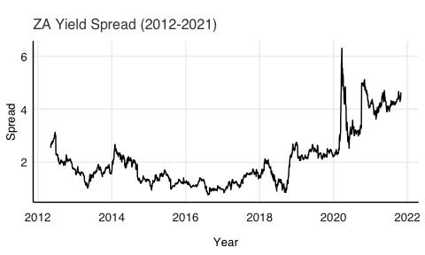
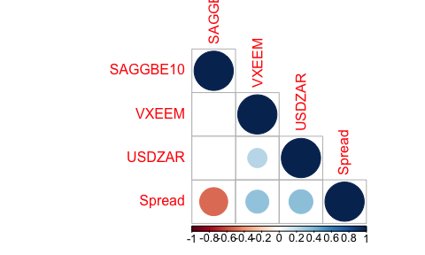

# Purpose

This work folder was created to be used in the evaluation for the
Financial Econometrics course presented at Stellebosch University for
the purpose of completing my Mcom (Economics). It outlines my workflow,
and rationale, while completing the tutorial.

Below, the r setup used throughout. Importantly, the packages loaded for
each question vary depending on the respective requirements.

``` r
knitr::opts_chunk$set(fig.align = "left", fig.height = 3, fig.pos = "H", fig.width = 5,
                      message=FALSE, warning=FALSE, comment = NA)
library(pacman)
pacman::p_load(fmxdat, Texevier, knitr, kableExtra, tidyverse, readr)
```

# Description

This folder was created using the fmxdat package
(<https://github.com/Nicktz/fmxdat>) with the following code:

``` r
fmxdat::make_project()
```

In addition, the folders used for the seperate questions (inside the
“root” *Questions* folder) were created using the Texevier package
(<https://github.com/Nicktz/Texevier>):

``` r
Texevier::create_template_html(directory = 'Questions', template_name = 'Question_1')
Texevier::create_template_html(directory='Questions', template_name = 'Question_2')
Texevier::create_template_html(directory='Questions', template_name = 'Question_3')
Texevier::create_template_html(directory='Questions', template_name = 'Question_4')
Texevier::create_template_html(directory='Questions', template_name = 'Question_5')
Texevier::create_template_html(directory='Questions', template_name = 'Question_6')
```

# Data

The relevant data used in completing this practical was sourced from:
<https://www.fmx.nfkatzke.com/FMX_data_2021.zip>.

The data sourced was all in .rds format, with accompanying txt files
providing brief descriptions for the relevant datasets. Data used to
complete this practical was placed in the “data” folder. These datasets,
however, are not available on this github (due to storage constraints),
and were excluded from the commits by updating the .gitignore file:
specifying that objects in “data/” should be ignored. In this folder,
there is a README.md file which provides an overview of the data. The
data used to complete questions will be specified when these questions
are addressed.

Data in .rds format was uploaded to the environment using code in the
following format:

``` r
somedat <- read_rds("data/some_data.rds")
```

# Question 1: Yield Spread

## Introduction

Bond yields are an important economic indicator, and can be seen as a
sign of investor sentiment about the economy. Interest rates and bond
yields have a positive relationship, and, to a large extent, lower
yields on Advanced Economy bonds can lead investors to search for yield
elsewhere. This means that when there is a “risk-on” sentiment in global
markets, and investors shift more capital into Emerging Markets, this
greater demand for bonds should drive up their prices and, by extension,
decrease the yield to investors. This sections of the README aims to
investigate trends in yield spreads using the data provided.

## Data

``` r
SA_bonds <- read_rds("/Users/tiagob/Documents/Masters 2021/Second Semester/Financial Econometrics/data/SA_Bonds.rds") %>%
    rename("ZA_3M"=SA_3M)
BE_Infl <- read_rds("/Users/tiagob/Documents/Masters 2021/Second Semester/Financial Econometrics/data/BE_Infl.rds")
bonds_2y <- read_rds("/Users/tiagob/Documents/Masters 2021/Second Semester/Financial Econometrics/data/bonds_2y.rds")
bonds_10y <- read_rds("/Users/tiagob/Documents/Masters 2021/Second Semester/Financial Econometrics/data/bonds_10y.rds")
usdzar <- read_rds("/Users/tiagob/Documents/Masters 2021/Second Semester/Financial Econometrics/data/usdzar.rds")
ZA_Infl <- read_rds("/Users/tiagob/Documents/Masters 2021/Second Semester/Financial Econometrics/data/ZA_Infl.rds")
VIX <- read_rds("/Users/tiagob/Documents/Masters 2021/Second Semester/Financial Econometrics/data/IV.rds")
ZAR_IY <- read_rds("/Users/tiagob/Documents/Masters 2021/Second Semester/Financial Econometrics/data/ZAR_IY.rds")
```

The data sourced includes information on bond yields for SA (SA_bonds),
as well as a wide basket of Advanced and Emerging economies (bonds_2y
and bonds_10y). Data on the USD:ZAR spot rate is provided in “usdzar”,
VIX is a composite volatility index including indicators for the US, EU,
and EME’s. ZA_Infl contains historical inflation rates for SA, and
BE_Infl is Break-Even Inflation, which gives an insight into the
market’s pricing of future inflation. Finally, ZAR_IY is the 6-month
forward implied yield for SA.

## Exploratory Analysis

Firstly, due to constraints on the time periods available for many of
the countries, and the reduced time frame available for the Break-Even
inflation variable, the sample was restricted to consider only dates
from 2012-05-06 (ie the first observation for BE_Infl).

Calculating bond spreads was done using the formula:
*S**p**r**e**a**d* = *Y**i**e**l**d*<sub>10*Y**r*</sub> − *Y**i**e**l**d*<sub>2*Y**r*</sub>

``` r
BRIC <- c("Brazil", "CHINA", "India", "Russia")
bonds_10y$Name <- gsub("_10Yr", "", bonds_10y$Name)
bonds_2y$Name <- gsub("_2yr", "", bonds_2y$Name) # remove unnecessary labels

BRICS_10Yr <- left_join(SA_bonds %>% arrange(date) %>% select(date, ZA_10Yr) %>% filter(date>ymd(20120506)), 
                        bonds_10y %>% filter(Name %in% BRIC) %>% spread(Name, Bond_10Yr) %>% 
    setNames(c("date", "BRA_10Yr", "CHN_10Yr", "IND_10Yr", "RUS_10Yr")) %>% filter(date>ymd(20120506)), by="date") %>%
    gather(Tickers, Val, -date)

SA_2Yr <- SA_bonds %>% arrange(date) %>% select(date, ZA_2Yr) %>% filter(date>ymd(20120506)) 

BRIC_2Yr <- bonds_2y %>% filter(Name %in% BRIC) %>% spread(Name, Bond_2Yr) %>% 
    setNames(c("date", "BRA_2Yr", "CHN_2Yr", "IND_2Yr", "RUS_2Yr")) %>% filter(date>ymd(20120506))

BRICS_2Yr <- left_join(SA_2Yr, BRIC_2Yr, by="date") %>% gather(Tickers, Val, -date)
```

``` r
BRICS_2Yr %>% ggplot() +
    geom_line(aes(date, Val, color=Tickers))  +fmxdat::theme_fmx() + fmxdat::fmx_cols()+
    labs(x="Year", y="Bond Yields",
         subtitle="BRICS 2Yr Bond Yields (2012-2021)")
```


``` r
BRICS_10Yr %>% ggplot() + geom_line(aes(date, Val, color=Tickers)) +fmxdat::theme_fmx() + fmxdat::fmx_cols()+
    labs(x="Year", y="Bond Yields",
         subtitle="BRICS 10Yr Bond Yields (2012-2021)")
```


``` r
BE_Infl %>% spread(Name, Price) %>%
    ggplot() + geom_line(aes(date, SAGGBE10)) +fmxdat::theme_fmx() + fmxdat::fmx_cols()+
    labs(x="Year", y="Break-Even Inflation", subtitle="BE Inflation (2012-2021)")
```


``` r
ZA_Infl %>% spread(Name, Price) %>% filter(date>ymd(20120506)) %>%
    ggplot() + geom_line(aes(date, ZAR_Infl)) +fmxdat::theme_fmx() + fmxdat::fmx_cols()+
    labs(x="Year", y="ZA Inflation", subtitle="ZA Inflation (2012-2021)")
```


``` r
usdzar %>% spread(Name, Price) %>% rename("USDZAR"= SouthAfrica_Cncy) %>% filter(date>ymd(20120506)) %>%
    ggplot() + geom_line(aes(date, USDZAR)) +fmxdat::theme_fmx() + fmxdat::fmx_cols()+
    labs(x="Year", y="USDZAR Spot", subtitle="USDZAR Spot (2012-2021)")
```


``` r
VIX %>% filter(Name=="VXEEM", date>ymd(20120506)) %>% spread(Name, Price) %>%
    ggplot() + geom_line(aes(date, VXEEM)) +fmxdat::theme_fmx() + fmxdat::fmx_cols()+
    labs(x="Year", y="VXEEM", subtitle="Emerging Market Volatility (2012-2021)")
```


``` r
consolidated_SA <- left_join(SA_2Yr, 
                          VIX %>% filter(Name=="VXEEM", date>ymd(20120506)) %>% spread(Name, Price),
                          by="date") %>%
    left_join(., SA_bonds %>% arrange(date) %>% select(date, ZA_10Yr) %>% filter(date>ymd(20120506)),
              by="date") %>% 
    left_join(., BE_Infl %>% spread(Name, Price), by="date") %>%
    left_join(., usdzar %>% spread(Name, Price) %>% rename("USDZAR"= SouthAfrica_Cncy) %>% filter(date>ymd(20120506)), by="date") %>% 
    left_join(., ZA_Infl %>% spread(Name, Price) %>% filter(date>ymd(20120506)), by="date") %>%
    mutate(Spread=ZA_10Yr-ZA_2Yr)

consolidated_SA %>% ggplot() + geom_line(aes(date, Spread)) + fmxdat::theme_fmx() +fmxdat::fmx_cols()+
    labs(x="Year", y="Spread", subtitle="ZA Yield Spread (2012-2021)")
```



As can be seen from the figure above, yield spreads have increased
significantly in SA since the COVID-19 pandemic, which coincides with a
sharp increase in the EME volatility index. The next section provides
descriptive statistics for the variables included in the consolidated SA
dataset, after which a correlation analysis will be performed to
determine the influence of the other variables on bond yield spreads in
SA.

### Descriptive Statistics

Tables 1-8 below provide descriptive statistics for the relevant
variables.

``` r
pastecs::stat.desc(SA_bonds[, -1])%>% kable(caption="Summary Statistics: SA Bonds (Full Sample)",  format="html", digits=2)
```

<table>
<caption>
Summary Statistics: SA Bonds (Full Sample)
</caption>
<thead>
<tr>
<th style="text-align:left;">
</th>
<th style="text-align:right;">
ZA_3M
</th>
<th style="text-align:right;">
ZA_10Yr
</th>
<th style="text-align:right;">
ZA_2Yr
</th>
</tr>
</thead>
<tbody>
<tr>
<td style="text-align:left;">
nbr.val
</td>
<td style="text-align:right;">
5715.00
</td>
<td style="text-align:right;">
5715.00
</td>
<td style="text-align:right;">
5715.00
</td>
</tr>
<tr>
<td style="text-align:left;">
nbr.null
</td>
<td style="text-align:right;">
0.00
</td>
<td style="text-align:right;">
0.00
</td>
<td style="text-align:right;">
0.00
</td>
</tr>
<tr>
<td style="text-align:left;">
nbr.na
</td>
<td style="text-align:right;">
0.00
</td>
<td style="text-align:right;">
0.00
</td>
<td style="text-align:right;">
0.00
</td>
</tr>
<tr>
<td style="text-align:left;">
min
</td>
<td style="text-align:right;">
3.33
</td>
<td style="text-align:right;">
6.03
</td>
<td style="text-align:right;">
3.90
</td>
</tr>
<tr>
<td style="text-align:left;">
max
</td>
<td style="text-align:right;">
13.60
</td>
<td style="text-align:right;">
15.27
</td>
<td style="text-align:right;">
12.95
</td>
</tr>
<tr>
<td style="text-align:left;">
range
</td>
<td style="text-align:right;">
10.27
</td>
<td style="text-align:right;">
9.24
</td>
<td style="text-align:right;">
9.04
</td>
</tr>
<tr>
<td style="text-align:left;">
sum
</td>
<td style="text-align:right;">
43740.68
</td>
<td style="text-align:right;">
52162.85
</td>
<td style="text-align:right;">
44320.87
</td>
</tr>
<tr>
<td style="text-align:left;">
median
</td>
<td style="text-align:right;">
7.14
</td>
<td style="text-align:right;">
8.72
</td>
<td style="text-align:right;">
7.25
</td>
</tr>
<tr>
<td style="text-align:left;">
mean
</td>
<td style="text-align:right;">
7.65
</td>
<td style="text-align:right;">
9.13
</td>
<td style="text-align:right;">
7.76
</td>
</tr>
<tr>
<td style="text-align:left;">
SE.mean
</td>
<td style="text-align:right;">
0.03
</td>
<td style="text-align:right;">
0.02
</td>
<td style="text-align:right;">
0.02
</td>
</tr>
<tr>
<td style="text-align:left;">
CI.mean.0.95
</td>
<td style="text-align:right;">
0.06
</td>
<td style="text-align:right;">
0.04
</td>
<td style="text-align:right;">
0.05
</td>
</tr>
<tr>
<td style="text-align:left;">
var
</td>
<td style="text-align:right;">
5.81
</td>
<td style="text-align:right;">
2.44
</td>
<td style="text-align:right;">
3.45
</td>
</tr>
<tr>
<td style="text-align:left;">
std.dev
</td>
<td style="text-align:right;">
2.41
</td>
<td style="text-align:right;">
1.56
</td>
<td style="text-align:right;">
1.86
</td>
</tr>
<tr>
<td style="text-align:left;">
coef.var
</td>
<td style="text-align:right;">
0.31
</td>
<td style="text-align:right;">
0.17
</td>
<td style="text-align:right;">
0.24
</td>
</tr>
</tbody>
</table>

``` r
# Since 2011
pastecs::stat.desc(SA_bonds %>% filter(date>ymd(20120506)) %>%
            .[, -1]) %>%  kable(caption="Summary Statistics: SA Bonds (Reduced Sample)",  format="html", digits=2)
```

<table>
<caption>
Summary Statistics: SA Bonds (Reduced Sample)
</caption>
<thead>
<tr>
<th style="text-align:left;">
</th>
<th style="text-align:right;">
ZA_3M
</th>
<th style="text-align:right;">
ZA_10Yr
</th>
<th style="text-align:right;">
ZA_2Yr
</th>
</tr>
</thead>
<tbody>
<tr>
<td style="text-align:left;">
nbr.val
</td>
<td style="text-align:right;">
2475.00
</td>
<td style="text-align:right;">
2475.00
</td>
<td style="text-align:right;">
2475.00
</td>
</tr>
<tr>
<td style="text-align:left;">
nbr.null
</td>
<td style="text-align:right;">
0.00
</td>
<td style="text-align:right;">
0.00
</td>
<td style="text-align:right;">
0.00
</td>
</tr>
<tr>
<td style="text-align:left;">
nbr.na
</td>
<td style="text-align:right;">
0.00
</td>
<td style="text-align:right;">
0.00
</td>
<td style="text-align:right;">
0.00
</td>
</tr>
<tr>
<td style="text-align:left;">
min
</td>
<td style="text-align:right;">
3.33
</td>
<td style="text-align:right;">
6.03
</td>
<td style="text-align:right;">
3.90
</td>
</tr>
<tr>
<td style="text-align:left;">
max
</td>
<td style="text-align:right;">
7.38
</td>
<td style="text-align:right;">
12.42
</td>
<td style="text-align:right;">
8.97
</td>
</tr>
<tr>
<td style="text-align:left;">
range
</td>
<td style="text-align:right;">
4.04
</td>
<td style="text-align:right;">
6.39
</td>
<td style="text-align:right;">
5.07
</td>
</tr>
<tr>
<td style="text-align:left;">
sum
</td>
<td style="text-align:right;">
14778.77
</td>
<td style="text-align:right;">
21180.26
</td>
<td style="text-align:right;">
16048.68
</td>
</tr>
<tr>
<td style="text-align:left;">
median
</td>
<td style="text-align:right;">
6.14
</td>
<td style="text-align:right;">
8.72
</td>
<td style="text-align:right;">
6.52
</td>
</tr>
<tr>
<td style="text-align:left;">
mean
</td>
<td style="text-align:right;">
5.97
</td>
<td style="text-align:right;">
8.56
</td>
<td style="text-align:right;">
6.48
</td>
</tr>
<tr>
<td style="text-align:left;">
SE.mean
</td>
<td style="text-align:right;">
0.03
</td>
<td style="text-align:right;">
0.02
</td>
<td style="text-align:right;">
0.02
</td>
</tr>
<tr>
<td style="text-align:left;">
CI.mean.0.95
</td>
<td style="text-align:right;">
0.05
</td>
<td style="text-align:right;">
0.03
</td>
<td style="text-align:right;">
0.04
</td>
</tr>
<tr>
<td style="text-align:left;">
var
</td>
<td style="text-align:right;">
1.56
</td>
<td style="text-align:right;">
0.64
</td>
<td style="text-align:right;">
0.98
</td>
</tr>
<tr>
<td style="text-align:left;">
std.dev
</td>
<td style="text-align:right;">
1.25
</td>
<td style="text-align:right;">
0.80
</td>
<td style="text-align:right;">
0.99
</td>
</tr>
<tr>
<td style="text-align:left;">
coef.var
</td>
<td style="text-align:right;">
0.21
</td>
<td style="text-align:right;">
0.09
</td>
<td style="text-align:right;">
0.15
</td>
</tr>
</tbody>
</table>

``` r
pastecs::stat.desc(BE_Infl %>% spread(Name, Price) %>% arrange(date) %>% .[, -1]) %>% kable(caption="Summary Statistics: BE Inflation", format="html", digits=2)
```

<table>
<caption>
Summary Statistics: BE Inflation
</caption>
<thead>
<tr>
<th style="text-align:left;">
</th>
<th style="text-align:right;">
SAGGBE10
</th>
</tr>
</thead>
<tbody>
<tr>
<td style="text-align:left;">
nbr.val
</td>
<td style="text-align:right;">
2475.00
</td>
</tr>
<tr>
<td style="text-align:left;">
nbr.null
</td>
<td style="text-align:right;">
0.00
</td>
</tr>
<tr>
<td style="text-align:left;">
nbr.na
</td>
<td style="text-align:right;">
0.00
</td>
</tr>
<tr>
<td style="text-align:left;">
min
</td>
<td style="text-align:right;">
4.50
</td>
</tr>
<tr>
<td style="text-align:left;">
max
</td>
<td style="text-align:right;">
7.88
</td>
</tr>
<tr>
<td style="text-align:left;">
range
</td>
<td style="text-align:right;">
3.38
</td>
</tr>
<tr>
<td style="text-align:left;">
sum
</td>
<td style="text-align:right;">
15061.74
</td>
</tr>
<tr>
<td style="text-align:left;">
median
</td>
<td style="text-align:right;">
6.09
</td>
</tr>
<tr>
<td style="text-align:left;">
mean
</td>
<td style="text-align:right;">
6.09
</td>
</tr>
<tr>
<td style="text-align:left;">
SE.mean
</td>
<td style="text-align:right;">
0.01
</td>
</tr>
<tr>
<td style="text-align:left;">
CI.mean.0.95
</td>
<td style="text-align:right;">
0.02
</td>
</tr>
<tr>
<td style="text-align:left;">
var
</td>
<td style="text-align:right;">
0.39
</td>
</tr>
<tr>
<td style="text-align:left;">
std.dev
</td>
<td style="text-align:right;">
0.63
</td>
</tr>
<tr>
<td style="text-align:left;">
coef.var
</td>
<td style="text-align:right;">
0.10
</td>
</tr>
</tbody>
</table>

``` r
pastecs::stat.desc(bonds_2y %>% filter(Name %in% BRIC) %>% 
            arrange(date) %>% spread(Name, Bond_2Yr) %>% 
            filter(date>ymd(20120506)) %>%
            .[,-1]) %>% kable(caption="Summary Statistics: BRIC 2yr Bonds", format="html", digits=2)
```

<table>
<caption>
Summary Statistics: BRIC 2yr Bonds
</caption>
<thead>
<tr>
<th style="text-align:left;">
</th>
<th style="text-align:right;">
Brazil
</th>
<th style="text-align:right;">
CHINA
</th>
<th style="text-align:right;">
India
</th>
<th style="text-align:right;">
Russia
</th>
</tr>
</thead>
<tbody>
<tr>
<td style="text-align:left;">
nbr.val
</td>
<td style="text-align:right;">
2475.00
</td>
<td style="text-align:right;">
2475.00
</td>
<td style="text-align:right;">
2475.00
</td>
<td style="text-align:right;">
2475.00
</td>
</tr>
<tr>
<td style="text-align:left;">
nbr.null
</td>
<td style="text-align:right;">
0.00
</td>
<td style="text-align:right;">
0.00
</td>
<td style="text-align:right;">
0.00
</td>
<td style="text-align:right;">
0.00
</td>
</tr>
<tr>
<td style="text-align:left;">
nbr.na
</td>
<td style="text-align:right;">
0.00
</td>
<td style="text-align:right;">
0.00
</td>
<td style="text-align:right;">
0.00
</td>
<td style="text-align:right;">
0.00
</td>
</tr>
<tr>
<td style="text-align:left;">
min
</td>
<td style="text-align:right;">
-3.58
</td>
<td style="text-align:right;">
1.31
</td>
<td style="text-align:right;">
3.85
</td>
<td style="text-align:right;">
4.30
</td>
</tr>
<tr>
<td style="text-align:left;">
max
</td>
<td style="text-align:right;">
4.32
</td>
<td style="text-align:right;">
4.38
</td>
<td style="text-align:right;">
9.93
</td>
<td style="text-align:right;">
17.50
</td>
</tr>
<tr>
<td style="text-align:left;">
range
</td>
<td style="text-align:right;">
7.90
</td>
<td style="text-align:right;">
3.07
</td>
<td style="text-align:right;">
6.08
</td>
<td style="text-align:right;">
13.20
</td>
</tr>
<tr>
<td style="text-align:left;">
sum
</td>
<td style="text-align:right;">
3760.55
</td>
<td style="text-align:right;">
7080.74
</td>
<td style="text-align:right;">
16862.42
</td>
<td style="text-align:right;">
18880.28
</td>
</tr>
<tr>
<td style="text-align:left;">
median
</td>
<td style="text-align:right;">
1.55
</td>
<td style="text-align:right;">
2.70
</td>
<td style="text-align:right;">
7.08
</td>
<td style="text-align:right;">
7.28
</td>
</tr>
<tr>
<td style="text-align:left;">
mean
</td>
<td style="text-align:right;">
1.52
</td>
<td style="text-align:right;">
2.86
</td>
<td style="text-align:right;">
6.81
</td>
<td style="text-align:right;">
7.63
</td>
</tr>
<tr>
<td style="text-align:left;">
SE.mean
</td>
<td style="text-align:right;">
0.01
</td>
<td style="text-align:right;">
0.01
</td>
<td style="text-align:right;">
0.03
</td>
<td style="text-align:right;">
0.04
</td>
</tr>
<tr>
<td style="text-align:left;">
CI.mean.0.95
</td>
<td style="text-align:right;">
0.03
</td>
<td style="text-align:right;">
0.02
</td>
<td style="text-align:right;">
0.05
</td>
<td style="text-align:right;">
0.08
</td>
</tr>
<tr>
<td style="text-align:left;">
var
</td>
<td style="text-align:right;">
0.50
</td>
<td style="text-align:right;">
0.25
</td>
<td style="text-align:right;">
1.80
</td>
<td style="text-align:right;">
4.37
</td>
</tr>
<tr>
<td style="text-align:left;">
std.dev
</td>
<td style="text-align:right;">
0.71
</td>
<td style="text-align:right;">
0.50
</td>
<td style="text-align:right;">
1.34
</td>
<td style="text-align:right;">
2.09
</td>
</tr>
<tr>
<td style="text-align:left;">
coef.var
</td>
<td style="text-align:right;">
0.47
</td>
<td style="text-align:right;">
0.18
</td>
<td style="text-align:right;">
0.20
</td>
<td style="text-align:right;">
0.27
</td>
</tr>
</tbody>
</table>

``` r
pastecs::stat.desc(bonds_10y %>% filter(Name %in% BRIC) %>%
                       arrange(date) %>% spread(Name, Bond_10Yr)  %>%
                       .[,-1])  %>% kable(caption="Summary Statistics: BRIC 10yr Bonds", format="html", digits=2)
```

<table>
<caption>
Summary Statistics: BRIC 10yr Bonds
</caption>
<thead>
<tr>
<th style="text-align:left;">
</th>
<th style="text-align:right;">
Brazil
</th>
<th style="text-align:right;">
CHINA
</th>
<th style="text-align:right;">
India
</th>
<th style="text-align:right;">
Russia
</th>
</tr>
</thead>
<tbody>
<tr>
<td style="text-align:left;">
nbr.val
</td>
<td style="text-align:right;">
3017.00
</td>
<td style="text-align:right;">
4165.00
</td>
<td style="text-align:right;">
5948.00
</td>
<td style="text-align:right;">
3016.00
</td>
</tr>
<tr>
<td style="text-align:left;">
nbr.null
</td>
<td style="text-align:right;">
0.00
</td>
<td style="text-align:right;">
0.00
</td>
<td style="text-align:right;">
0.00
</td>
<td style="text-align:right;">
0.00
</td>
</tr>
<tr>
<td style="text-align:left;">
nbr.na
</td>
<td style="text-align:right;">
2931.00
</td>
<td style="text-align:right;">
1783.00
</td>
<td style="text-align:right;">
0.00
</td>
<td style="text-align:right;">
2932.00
</td>
</tr>
<tr>
<td style="text-align:left;">
min
</td>
<td style="text-align:right;">
2.33
</td>
<td style="text-align:right;">
2.47
</td>
<td style="text-align:right;">
4.95
</td>
<td style="text-align:right;">
5.43
</td>
</tr>
<tr>
<td style="text-align:left;">
max
</td>
<td style="text-align:right;">
7.29
</td>
<td style="text-align:right;">
4.71
</td>
<td style="text-align:right;">
12.23
</td>
<td style="text-align:right;">
16.06
</td>
</tr>
<tr>
<td style="text-align:left;">
range
</td>
<td style="text-align:right;">
4.96
</td>
<td style="text-align:right;">
2.24
</td>
<td style="text-align:right;">
7.28
</td>
<td style="text-align:right;">
10.63
</td>
</tr>
<tr>
<td style="text-align:left;">
sum
</td>
<td style="text-align:right;">
13358.30
</td>
<td style="text-align:right;">
14536.20
</td>
<td style="text-align:right;">
46100.40
</td>
<td style="text-align:right;">
24359.46
</td>
</tr>
<tr>
<td style="text-align:left;">
median
</td>
<td style="text-align:right;">
4.44
</td>
<td style="text-align:right;">
3.43
</td>
<td style="text-align:right;">
7.66
</td>
<td style="text-align:right;">
7.88
</td>
</tr>
<tr>
<td style="text-align:left;">
mean
</td>
<td style="text-align:right;">
4.43
</td>
<td style="text-align:right;">
3.49
</td>
<td style="text-align:right;">
7.75
</td>
<td style="text-align:right;">
8.08
</td>
</tr>
<tr>
<td style="text-align:left;">
SE.mean
</td>
<td style="text-align:right;">
0.02
</td>
<td style="text-align:right;">
0.01
</td>
<td style="text-align:right;">
0.02
</td>
<td style="text-align:right;">
0.03
</td>
</tr>
<tr>
<td style="text-align:left;">
CI.mean.0.95
</td>
<td style="text-align:right;">
0.03
</td>
<td style="text-align:right;">
0.01
</td>
<td style="text-align:right;">
0.04
</td>
<td style="text-align:right;">
0.05
</td>
</tr>
<tr>
<td style="text-align:left;">
var
</td>
<td style="text-align:right;">
0.75
</td>
<td style="text-align:right;">
0.21
</td>
<td style="text-align:right;">
2.27
</td>
<td style="text-align:right;">
2.11
</td>
</tr>
<tr>
<td style="text-align:left;">
std.dev
</td>
<td style="text-align:right;">
0.87
</td>
<td style="text-align:right;">
0.46
</td>
<td style="text-align:right;">
1.51
</td>
<td style="text-align:right;">
1.45
</td>
</tr>
<tr>
<td style="text-align:left;">
coef.var
</td>
<td style="text-align:right;">
0.20
</td>
<td style="text-align:right;">
0.13
</td>
<td style="text-align:right;">
0.19
</td>
<td style="text-align:right;">
0.18
</td>
</tr>
</tbody>
</table>

``` r
pastecs::stat.desc(usdzar %>% spread(Name, Price) %>%
                       arrange(date)  %>%
                       .[,-1]) %>% kable(caption="Summary Statistics: USDZAR Spot", format="html", digits=2)
```

<table>
<caption>
Summary Statistics: USDZAR Spot
</caption>
<thead>
<tr>
<th style="text-align:left;">
</th>
<th style="text-align:right;">
SouthAfrica_Cncy
</th>
</tr>
</thead>
<tbody>
<tr>
<td style="text-align:left;">
nbr.val
</td>
<td style="text-align:right;">
8305.00
</td>
</tr>
<tr>
<td style="text-align:left;">
nbr.null
</td>
<td style="text-align:right;">
0.00
</td>
</tr>
<tr>
<td style="text-align:left;">
nbr.na
</td>
<td style="text-align:right;">
0.00
</td>
</tr>
<tr>
<td style="text-align:left;">
min
</td>
<td style="text-align:right;">
2.50
</td>
</tr>
<tr>
<td style="text-align:left;">
max
</td>
<td style="text-align:right;">
19.08
</td>
</tr>
<tr>
<td style="text-align:left;">
range
</td>
<td style="text-align:right;">
16.59
</td>
</tr>
<tr>
<td style="text-align:left;">
sum
</td>
<td style="text-align:right;">
66913.44
</td>
</tr>
<tr>
<td style="text-align:left;">
median
</td>
<td style="text-align:right;">
7.28
</td>
</tr>
<tr>
<td style="text-align:left;">
mean
</td>
<td style="text-align:right;">
8.06
</td>
</tr>
<tr>
<td style="text-align:left;">
SE.mean
</td>
<td style="text-align:right;">
0.04
</td>
</tr>
<tr>
<td style="text-align:left;">
CI.mean.0.95
</td>
<td style="text-align:right;">
0.08
</td>
</tr>
<tr>
<td style="text-align:left;">
var
</td>
<td style="text-align:right;">
15.45
</td>
</tr>
<tr>
<td style="text-align:left;">
std.dev
</td>
<td style="text-align:right;">
3.93
</td>
</tr>
<tr>
<td style="text-align:left;">
coef.var
</td>
<td style="text-align:right;">
0.49
</td>
</tr>
</tbody>
</table>

``` r
pastecs::stat.desc(ZA_Infl %>% spread(Name, Price) %>%
                       arrange(date) %>% filter(date>ymd(20120506)) %>%
                       .[,-1]) %>% kable(caption="Summary Statistics: ZA Inflation", format="html", digits=2)
```

<table>
<caption>
Summary Statistics: ZA Inflation
</caption>
<thead>
<tr>
<th style="text-align:left;">
</th>
<th style="text-align:right;">
ZAR_Infl
</th>
</tr>
</thead>
<tbody>
<tr>
<td style="text-align:left;">
nbr.val
</td>
<td style="text-align:right;">
114.00
</td>
</tr>
<tr>
<td style="text-align:left;">
nbr.null
</td>
<td style="text-align:right;">
0.00
</td>
</tr>
<tr>
<td style="text-align:left;">
nbr.na
</td>
<td style="text-align:right;">
0.00
</td>
</tr>
<tr>
<td style="text-align:left;">
min
</td>
<td style="text-align:right;">
2.10
</td>
</tr>
<tr>
<td style="text-align:left;">
max
</td>
<td style="text-align:right;">
7.00
</td>
</tr>
<tr>
<td style="text-align:left;">
range
</td>
<td style="text-align:right;">
4.90
</td>
</tr>
<tr>
<td style="text-align:left;">
sum
</td>
<td style="text-align:right;">
567.00
</td>
</tr>
<tr>
<td style="text-align:left;">
median
</td>
<td style="text-align:right;">
5.00
</td>
</tr>
<tr>
<td style="text-align:left;">
mean
</td>
<td style="text-align:right;">
4.97
</td>
</tr>
<tr>
<td style="text-align:left;">
SE.mean
</td>
<td style="text-align:right;">
0.10
</td>
</tr>
<tr>
<td style="text-align:left;">
CI.mean.0.95
</td>
<td style="text-align:right;">
0.19
</td>
</tr>
<tr>
<td style="text-align:left;">
var
</td>
<td style="text-align:right;">
1.10
</td>
</tr>
<tr>
<td style="text-align:left;">
std.dev
</td>
<td style="text-align:right;">
1.05
</td>
</tr>
<tr>
<td style="text-align:left;">
coef.var
</td>
<td style="text-align:right;">
0.21
</td>
</tr>
</tbody>
</table>

``` r
pastecs::stat.desc(VIX %>% filter(Name=="VXEEM") %>% spread(Name, Price) %>% arrange(date) %>%
    filter(date>ymd(20120506)) %>%
    .[,-1]) %>% kable(caption="Summary Statistics: VIX (Emerging Markets)", format="html", digits=2)
```

<table>
<caption>
Summary Statistics: VIX (Emerging Markets)
</caption>
<thead>
<tr>
<th style="text-align:left;">
</th>
<th style="text-align:right;">
VXEEM
</th>
</tr>
</thead>
<tbody>
<tr>
<td style="text-align:left;">
nbr.val
</td>
<td style="text-align:right;">
2475.00
</td>
</tr>
<tr>
<td style="text-align:left;">
nbr.null
</td>
<td style="text-align:right;">
0.00
</td>
</tr>
<tr>
<td style="text-align:left;">
nbr.na
</td>
<td style="text-align:right;">
0.00
</td>
</tr>
<tr>
<td style="text-align:left;">
min
</td>
<td style="text-align:right;">
13.28
</td>
</tr>
<tr>
<td style="text-align:left;">
max
</td>
<td style="text-align:right;">
92.46
</td>
</tr>
<tr>
<td style="text-align:left;">
range
</td>
<td style="text-align:right;">
79.18
</td>
</tr>
<tr>
<td style="text-align:left;">
sum
</td>
<td style="text-align:right;">
55177.27
</td>
</tr>
<tr>
<td style="text-align:left;">
median
</td>
<td style="text-align:right;">
21.16
</td>
</tr>
<tr>
<td style="text-align:left;">
mean
</td>
<td style="text-align:right;">
22.29
</td>
</tr>
<tr>
<td style="text-align:left;">
SE.mean
</td>
<td style="text-align:right;">
0.13
</td>
</tr>
<tr>
<td style="text-align:left;">
CI.mean.0.95
</td>
<td style="text-align:right;">
0.25
</td>
</tr>
<tr>
<td style="text-align:left;">
var
</td>
<td style="text-align:right;">
41.09
</td>
</tr>
<tr>
<td style="text-align:left;">
std.dev
</td>
<td style="text-align:right;">
6.41
</td>
</tr>
<tr>
<td style="text-align:left;">
coef.var
</td>
<td style="text-align:right;">
0.29
</td>
</tr>
</tbody>
</table>

For the VIX data, only EME volatility was considered, and for the bond
yields (2 and 10 year), the sample was restricted to only consider the
BRIC economies. For the remainder of this discussion, focus will be on
the domestic (South African) economy.

## Correlation Analysis

``` r
consolidated_SA <- consolidated_SA %>% select(-ZA_2Yr, -ZA_10Yr, -ZAR_Infl) # to avoid unnecessary correlations (inflation captured by BE_infl, Spread captures bond yields at diff. maturities)

# Saving objects for corrplot
M <- consolidated_SA %>% select(-date)
M1 <- cor(M)


cor.mtest <- function(mat, ...) {
 mat <- as.matrix(mat)
n <- ncol(mat)
p.mat<- matrix(NA, n, n)
diag(p.mat) <- 0
for (i in 1:(n - 1)) {
     for (j in (i + 1):n) {
         tmp <- cor.test(mat[, i], mat[, j], ...)
           p.mat[i, j] <- p.mat[j, i] <- tmp$p.value
       }
   }
   colnames(p.mat) <- rownames(p.mat) <- colnames(mat)
   p.mat
 }
p.mat <- cor.mtest(M)
```

``` r
corrplot(M1, type="lower", order="hclust",  p.mat = p.mat, sig.level = 0.01, insig = "blank")
```



``` r
cor1 <- cor.test(consolidated_SA$Spread, consolidated_SA$SAGGBE10, method="pearson")
cor2 <- cor.test(consolidated_SA$Spread, consolidated_SA$USDZAR, method="pearson")
cor3 <- cor.test(consolidated_SA$Spread, consolidated_SA$VXEEM, method="pearson")
```

The yield spread on SA bonds is therefore positively related to the EM
volatility index (0.342602, p-value=4.1763533^{-69}), the USDZAR spot
rate (0.3693363, p-value=7.6125429^{-81}), and negatively related to the
Break-Even inflation measure (-0.5098304, p-value=7.1673854^{-164}). The
stronger US dollar vis-a-vis the Rand, and the greater perceived ‘risk’
in EM’s (measured by the VXEEM index) since the onset of the COVID-19
pandemic, can therefore be seen as two potential causes of the
significantly higher yield spreads seen in SA since 2020.

# Question 2:

# Question 3:

# Question 4:
