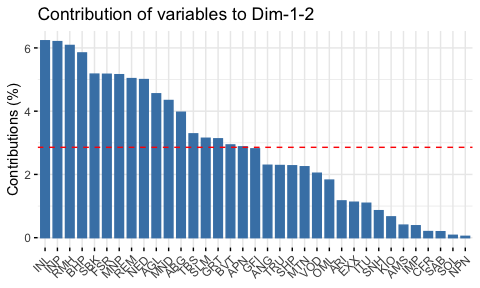

# Purpose

This work folder was created to be used in the evaluation for the
Financial Econometrics course presented at Stellebosch University for
the purpose of completing my Mcom (Economics). It outlines my workflow,
and rationale, while completing the tutorial.

Below, the r setup used throughout. Importantly, the packages loaded for
each question vary depending on the respective requirements.

``` r
knitr::opts_chunk$set(fig.align = "left", fig.height = 3, fig.pos = "H", fig.width = 5,
                      message=FALSE, warning=FALSE, comment = NA)
library(pacman)
pacman::p_load(fmxdat, Texevier, knitr, kableExtra, tidyverse, readr)
```

# Description

This folder was created using the fmxdat package
(<https://github.com/Nicktz/fmxdat>) with the following code:

``` r
fmxdat::make_project()
```

In addition, the folders used for the seperate questions (inside the
“root” *Questions* folder) were created using the Texevier package
(<https://github.com/Nicktz/Texevier>):

``` r
Texevier::create_template_html(directory = 'Questions', template_name = 'Question_1')
Texevier::create_template_html(directory='Questions', template_name = 'Question_2')
Texevier::create_template_html(directory='Questions', template_name = 'Question_3')
Texevier::create_template_html(directory='Questions', template_name = 'Question_4')
Texevier::create_template_html(directory='Questions', template_name = 'Question_5')
Texevier::create_template_html(directory='Questions', template_name = 'Question_6')
```

# Data

The relevant data used in completing this practical was sourced from:
<https://www.fmx.nfkatzke.com/FMX_data_2021.zip>.

The data sourced was all in .rds format, with accompanying txt files
providing brief descriptions for the relevant datasets. Data used to
complete this practical was placed in the “data” folder. These datasets,
however, are not available on this github (due to storage constraints),
and were excluded from the commits by updating the .gitignore file:
specifying that objects in “data/” should be ignored. In this folder,
there is a README.md file which provides an overview of the data. The
data used to complete questions will be specified when these questions
are addressed.

Data in .rds format was uploaded to the environment using code in the
following format:

``` r
somedat <- read_rds("data/some_data.rds")
```

# Question 1: Yield Spread

## Introduction

Bond yields are an important economic indicator, and can be seen as a
sign of investor sentiment about the economy. Interest rates and bond
yields have a positive relationship, and, to a large extent, lower
yields on Advanced Economy bonds can lead investors to search for yield
elsewhere. This means that when there is a “risk-on” sentiment in global
markets, and investors shift more capital into Emerging Markets, this
greater demand for bonds should drive up their prices and, by extension,
decrease the yield to investors. This sections of the README aims to
investigate trends in yield spreads using the data provided.

## Data

``` r
SA_bonds <- read_rds("/Users/tiagob/Documents/Masters 2021/Second Semester/Financial Econometrics/data/SA_Bonds.rds") %>%
    rename("ZA_3M"=SA_3M)
BE_Infl <- read_rds("/Users/tiagob/Documents/Masters 2021/Second Semester/Financial Econometrics/data/BE_Infl.rds")
bonds_2y <- read_rds("/Users/tiagob/Documents/Masters 2021/Second Semester/Financial Econometrics/data/bonds_2y.rds")
bonds_10y <- read_rds("/Users/tiagob/Documents/Masters 2021/Second Semester/Financial Econometrics/data/bonds_10y.rds")
usdzar <- read_rds("/Users/tiagob/Documents/Masters 2021/Second Semester/Financial Econometrics/data/usdzar.rds")
ZA_Infl <- read_rds("/Users/tiagob/Documents/Masters 2021/Second Semester/Financial Econometrics/data/ZA_Infl.rds")
VIX <- read_rds("/Users/tiagob/Documents/Masters 2021/Second Semester/Financial Econometrics/data/IV.rds")
ZAR_IY <- read_rds("/Users/tiagob/Documents/Masters 2021/Second Semester/Financial Econometrics/data/ZAR_IY.rds")
```

The data sourced includes information on bond yields for SA (SA_bonds),
as well as a wide basket of Advanced and Emerging economies (bonds_2y
and bonds_10y). Data on the USD:ZAR spot rate is provided in “usdzar”,
VIX is a composite volatility index including indicators for the US, EU,
and EME’s. ZA_Infl contains historical inflation rates for SA, and
BE_Infl is Break-Even Inflation, which gives an insight into the
market’s pricing of future inflation. Finally, ZAR_IY is the 6-month
forward implied yield for SA.

## Exploratory Analysis

Firstly, due to constraints on the time periods available for many of
the countries, and the reduced time frame available for the Break-Even
inflation variable, the sample was restricted to consider only dates
from 2012-05-06 (ie the first observation for BE_Infl).

Calculating bond spreads was done using the formula:
*S**p**r**e**a**d* = *Y**i**e**l**d*<sub>10*Y**r*</sub> − *Y**i**e**l**d*<sub>2*Y**r*</sub>

``` r
BRIC <- c("Brazil", "CHINA", "India", "Russia")
bonds_10y$Name <- gsub("_10Yr", "", bonds_10y$Name)
bonds_2y$Name <- gsub("_2yr", "", bonds_2y$Name) # remove unnecessary labels

BRICS_10Yr <- left_join(SA_bonds %>% arrange(date) %>% select(date, ZA_10Yr) %>% filter(date>ymd(20120506)), 
                        bonds_10y %>% filter(Name %in% BRIC) %>% spread(Name, Bond_10Yr) %>% 
    setNames(c("date", "BRA_10Yr", "CHN_10Yr", "IND_10Yr", "RUS_10Yr")) %>% filter(date>ymd(20120506)), by="date") %>%
    gather(Tickers, Val, -date)

SA_2Yr <- SA_bonds %>% arrange(date) %>% select(date, ZA_2Yr) %>% filter(date>ymd(20120506)) 

BRIC_2Yr <- bonds_2y %>% filter(Name %in% BRIC) %>% spread(Name, Bond_2Yr) %>% 
    setNames(c("date", "BRA_2Yr", "CHN_2Yr", "IND_2Yr", "RUS_2Yr")) %>% filter(date>ymd(20120506))

BRICS_2Yr <- left_join(SA_2Yr, BRIC_2Yr, by="date") %>% gather(Tickers, Val, -date)
```

``` r
BRICS_2Yr %>% ggplot() +
    geom_line(aes(date, Val, color=Tickers))  +fmxdat::theme_fmx() + fmxdat::fmx_cols()+
    labs(x="Year", y="Bond Yields",
         subtitle="BRICS 2Yr Bond Yields (2012-2021)")
```

<div class="figure" style="text-align: left">


<p class="caption">
BRICS 2Yr Bond Yields (2012-2021)
</p>

</div>

``` r
BRICS_10Yr %>% ggplot() + geom_line(aes(date, Val, color=Tickers)) +fmxdat::theme_fmx() + fmxdat::fmx_cols()+
    labs(x="Year", y="Bond Yields",
         subtitle="BRICS 10Yr Bond Yields (2012-2021)")
```

<div class="figure" style="text-align: left">


<p class="caption">
BRICS 10Yr Bond Yields (2012-2021)
</p>

</div>

``` r
BE_Infl %>% spread(Name, Price) %>%
    ggplot() + geom_line(aes(date, SAGGBE10)) +fmxdat::theme_fmx() + fmxdat::fmx_cols()+
    labs(x="Year", y="Break-Even Inflation", subtitle="BE Inflation (2012-2021)")
```

<div class="figure" style="text-align: left">


<p class="caption">
BE Inflation (2012-2021)
</p>

</div>

``` r
ZA_Infl %>% spread(Name, Price) %>% filter(date>ymd(20120506)) %>%
    ggplot() + geom_line(aes(date, ZAR_Infl)) +fmxdat::theme_fmx() + fmxdat::fmx_cols()+
    labs(x="Year", y="ZA Inflation", subtitle="ZA Inflation (2012-2021)")
```

<div class="figure" style="text-align: left">


<p class="caption">
ZA Inflation (2012-2021)
</p>

</div>

``` r
usdzar %>% spread(Name, Price) %>% rename("USDZAR"= SouthAfrica_Cncy) %>% filter(date>ymd(20120506)) %>%
    ggplot() + geom_line(aes(date, USDZAR)) +fmxdat::theme_fmx() + fmxdat::fmx_cols()+
    labs(x="Year", y="USDZAR Spot", subtitle="USDZAR Spot (2012-2021)")
```

<div class="figure" style="text-align: left">


<p class="caption">
USDZAR Spot (2012-2021)
</p>

</div>

``` r
VIX %>% filter(Name=="VXEEM", date>ymd(20120506)) %>% spread(Name, Price) %>%
    ggplot() + geom_line(aes(date, VXEEM)) +fmxdat::theme_fmx() + fmxdat::fmx_cols()+
    labs(x="Year", y="VXEEM", subtitle="Emerging Market Volatility (2012-2021)")
```

<div class="figure" style="text-align: left">


<p class="caption">
Emerging Market Volatility (2012-2021)
</p>

</div>

``` r
consolidated_SA <- left_join(SA_2Yr, 
                          VIX %>% filter(Name=="VXEEM", date>ymd(20120506)) %>% spread(Name, Price),
                          by="date") %>%
    left_join(., SA_bonds %>% arrange(date) %>% select(date, ZA_10Yr) %>% filter(date>ymd(20120506)),
              by="date") %>% 
    left_join(., BE_Infl %>% spread(Name, Price), by="date") %>%
    left_join(., usdzar %>% spread(Name, Price) %>% rename("USDZAR"= SouthAfrica_Cncy) %>% filter(date>ymd(20120506)), by="date") %>% 
    left_join(., ZA_Infl %>% spread(Name, Price) %>% filter(date>ymd(20120506)), by="date") %>%
    mutate(Spread=ZA_10Yr-ZA_2Yr)
```

``` r
consolidated_SA %>% ggplot() + geom_line(aes(date, Spread)) + fmxdat::theme_fmx() +fmxdat::fmx_cols()+
    labs(x="Year", y="Spread", subtitle="ZA Yield Spread (2012-2021)")
```

<div class="figure" style="text-align: left">


<p class="caption">
ZA Yield Spread (2012-2021)
</p>

</div>

As can be seen from the figure above, yield spreads have increased
significantly in SA since the COVID-19 pandemic, which coincides with a
sharp increase in the EME volatility index. The next section provides
descriptive statistics for the variables included in the consolidated SA
dataset, after which a correlation analysis will be performed to
determine the influence of the other variables on bond yield spreads in
SA.

### Descriptive Statistics

Tables 1-8 below provide descriptive statistics for the relevant
variables.

``` r
pastecs::stat.desc(SA_bonds[, -1])%>% kable(caption="Summary Statistics: SA Bonds (Full Sample)",  format="html", digits=2)
```

<table>
<caption>
Summary Statistics: SA Bonds (Full Sample)
</caption>
<thead>
<tr>
<th style="text-align:left;">
</th>
<th style="text-align:right;">
ZA_3M
</th>
<th style="text-align:right;">
ZA_10Yr
</th>
<th style="text-align:right;">
ZA_2Yr
</th>
</tr>
</thead>
<tbody>
<tr>
<td style="text-align:left;">
nbr.val
</td>
<td style="text-align:right;">
5715.00
</td>
<td style="text-align:right;">
5715.00
</td>
<td style="text-align:right;">
5715.00
</td>
</tr>
<tr>
<td style="text-align:left;">
nbr.null
</td>
<td style="text-align:right;">
0.00
</td>
<td style="text-align:right;">
0.00
</td>
<td style="text-align:right;">
0.00
</td>
</tr>
<tr>
<td style="text-align:left;">
nbr.na
</td>
<td style="text-align:right;">
0.00
</td>
<td style="text-align:right;">
0.00
</td>
<td style="text-align:right;">
0.00
</td>
</tr>
<tr>
<td style="text-align:left;">
min
</td>
<td style="text-align:right;">
3.33
</td>
<td style="text-align:right;">
6.03
</td>
<td style="text-align:right;">
3.90
</td>
</tr>
<tr>
<td style="text-align:left;">
max
</td>
<td style="text-align:right;">
13.60
</td>
<td style="text-align:right;">
15.27
</td>
<td style="text-align:right;">
12.95
</td>
</tr>
<tr>
<td style="text-align:left;">
range
</td>
<td style="text-align:right;">
10.27
</td>
<td style="text-align:right;">
9.24
</td>
<td style="text-align:right;">
9.04
</td>
</tr>
<tr>
<td style="text-align:left;">
sum
</td>
<td style="text-align:right;">
43740.68
</td>
<td style="text-align:right;">
52162.85
</td>
<td style="text-align:right;">
44320.87
</td>
</tr>
<tr>
<td style="text-align:left;">
median
</td>
<td style="text-align:right;">
7.14
</td>
<td style="text-align:right;">
8.72
</td>
<td style="text-align:right;">
7.25
</td>
</tr>
<tr>
<td style="text-align:left;">
mean
</td>
<td style="text-align:right;">
7.65
</td>
<td style="text-align:right;">
9.13
</td>
<td style="text-align:right;">
7.76
</td>
</tr>
<tr>
<td style="text-align:left;">
SE.mean
</td>
<td style="text-align:right;">
0.03
</td>
<td style="text-align:right;">
0.02
</td>
<td style="text-align:right;">
0.02
</td>
</tr>
<tr>
<td style="text-align:left;">
CI.mean.0.95
</td>
<td style="text-align:right;">
0.06
</td>
<td style="text-align:right;">
0.04
</td>
<td style="text-align:right;">
0.05
</td>
</tr>
<tr>
<td style="text-align:left;">
var
</td>
<td style="text-align:right;">
5.81
</td>
<td style="text-align:right;">
2.44
</td>
<td style="text-align:right;">
3.45
</td>
</tr>
<tr>
<td style="text-align:left;">
std.dev
</td>
<td style="text-align:right;">
2.41
</td>
<td style="text-align:right;">
1.56
</td>
<td style="text-align:right;">
1.86
</td>
</tr>
<tr>
<td style="text-align:left;">
coef.var
</td>
<td style="text-align:right;">
0.31
</td>
<td style="text-align:right;">
0.17
</td>
<td style="text-align:right;">
0.24
</td>
</tr>
</tbody>
</table>

``` r
# Since 2011
pastecs::stat.desc(SA_bonds %>% filter(date>ymd(20120506)) %>%
            .[, -1]) %>%  kable(caption="Summary Statistics: SA Bonds (Reduced Sample)",  format="html", digits=2)
```

<table>
<caption>
Summary Statistics: SA Bonds (Reduced Sample)
</caption>
<thead>
<tr>
<th style="text-align:left;">
</th>
<th style="text-align:right;">
ZA_3M
</th>
<th style="text-align:right;">
ZA_10Yr
</th>
<th style="text-align:right;">
ZA_2Yr
</th>
</tr>
</thead>
<tbody>
<tr>
<td style="text-align:left;">
nbr.val
</td>
<td style="text-align:right;">
2475.00
</td>
<td style="text-align:right;">
2475.00
</td>
<td style="text-align:right;">
2475.00
</td>
</tr>
<tr>
<td style="text-align:left;">
nbr.null
</td>
<td style="text-align:right;">
0.00
</td>
<td style="text-align:right;">
0.00
</td>
<td style="text-align:right;">
0.00
</td>
</tr>
<tr>
<td style="text-align:left;">
nbr.na
</td>
<td style="text-align:right;">
0.00
</td>
<td style="text-align:right;">
0.00
</td>
<td style="text-align:right;">
0.00
</td>
</tr>
<tr>
<td style="text-align:left;">
min
</td>
<td style="text-align:right;">
3.33
</td>
<td style="text-align:right;">
6.03
</td>
<td style="text-align:right;">
3.90
</td>
</tr>
<tr>
<td style="text-align:left;">
max
</td>
<td style="text-align:right;">
7.38
</td>
<td style="text-align:right;">
12.42
</td>
<td style="text-align:right;">
8.97
</td>
</tr>
<tr>
<td style="text-align:left;">
range
</td>
<td style="text-align:right;">
4.04
</td>
<td style="text-align:right;">
6.39
</td>
<td style="text-align:right;">
5.07
</td>
</tr>
<tr>
<td style="text-align:left;">
sum
</td>
<td style="text-align:right;">
14778.77
</td>
<td style="text-align:right;">
21180.26
</td>
<td style="text-align:right;">
16048.68
</td>
</tr>
<tr>
<td style="text-align:left;">
median
</td>
<td style="text-align:right;">
6.14
</td>
<td style="text-align:right;">
8.72
</td>
<td style="text-align:right;">
6.52
</td>
</tr>
<tr>
<td style="text-align:left;">
mean
</td>
<td style="text-align:right;">
5.97
</td>
<td style="text-align:right;">
8.56
</td>
<td style="text-align:right;">
6.48
</td>
</tr>
<tr>
<td style="text-align:left;">
SE.mean
</td>
<td style="text-align:right;">
0.03
</td>
<td style="text-align:right;">
0.02
</td>
<td style="text-align:right;">
0.02
</td>
</tr>
<tr>
<td style="text-align:left;">
CI.mean.0.95
</td>
<td style="text-align:right;">
0.05
</td>
<td style="text-align:right;">
0.03
</td>
<td style="text-align:right;">
0.04
</td>
</tr>
<tr>
<td style="text-align:left;">
var
</td>
<td style="text-align:right;">
1.56
</td>
<td style="text-align:right;">
0.64
</td>
<td style="text-align:right;">
0.98
</td>
</tr>
<tr>
<td style="text-align:left;">
std.dev
</td>
<td style="text-align:right;">
1.25
</td>
<td style="text-align:right;">
0.80
</td>
<td style="text-align:right;">
0.99
</td>
</tr>
<tr>
<td style="text-align:left;">
coef.var
</td>
<td style="text-align:right;">
0.21
</td>
<td style="text-align:right;">
0.09
</td>
<td style="text-align:right;">
0.15
</td>
</tr>
</tbody>
</table>

``` r
pastecs::stat.desc(BE_Infl %>% spread(Name, Price) %>% arrange(date) %>% .[, -1]) %>% kable(caption="Summary Statistics: BE Inflation", format="html", digits=2)
```

<table>
<caption>
Summary Statistics: BE Inflation
</caption>
<thead>
<tr>
<th style="text-align:left;">
</th>
<th style="text-align:right;">
SAGGBE10
</th>
</tr>
</thead>
<tbody>
<tr>
<td style="text-align:left;">
nbr.val
</td>
<td style="text-align:right;">
2475.00
</td>
</tr>
<tr>
<td style="text-align:left;">
nbr.null
</td>
<td style="text-align:right;">
0.00
</td>
</tr>
<tr>
<td style="text-align:left;">
nbr.na
</td>
<td style="text-align:right;">
0.00
</td>
</tr>
<tr>
<td style="text-align:left;">
min
</td>
<td style="text-align:right;">
4.50
</td>
</tr>
<tr>
<td style="text-align:left;">
max
</td>
<td style="text-align:right;">
7.88
</td>
</tr>
<tr>
<td style="text-align:left;">
range
</td>
<td style="text-align:right;">
3.38
</td>
</tr>
<tr>
<td style="text-align:left;">
sum
</td>
<td style="text-align:right;">
15061.74
</td>
</tr>
<tr>
<td style="text-align:left;">
median
</td>
<td style="text-align:right;">
6.09
</td>
</tr>
<tr>
<td style="text-align:left;">
mean
</td>
<td style="text-align:right;">
6.09
</td>
</tr>
<tr>
<td style="text-align:left;">
SE.mean
</td>
<td style="text-align:right;">
0.01
</td>
</tr>
<tr>
<td style="text-align:left;">
CI.mean.0.95
</td>
<td style="text-align:right;">
0.02
</td>
</tr>
<tr>
<td style="text-align:left;">
var
</td>
<td style="text-align:right;">
0.39
</td>
</tr>
<tr>
<td style="text-align:left;">
std.dev
</td>
<td style="text-align:right;">
0.63
</td>
</tr>
<tr>
<td style="text-align:left;">
coef.var
</td>
<td style="text-align:right;">
0.10
</td>
</tr>
</tbody>
</table>

``` r
pastecs::stat.desc(bonds_2y %>% filter(Name %in% BRIC) %>% 
            arrange(date) %>% spread(Name, Bond_2Yr) %>% 
            filter(date>ymd(20120506)) %>%
            .[,-1]) %>% kable(caption="Summary Statistics: BRIC 2yr Bonds", format="html", digits=2)
```

<table>
<caption>
Summary Statistics: BRIC 2yr Bonds
</caption>
<thead>
<tr>
<th style="text-align:left;">
</th>
<th style="text-align:right;">
Brazil
</th>
<th style="text-align:right;">
CHINA
</th>
<th style="text-align:right;">
India
</th>
<th style="text-align:right;">
Russia
</th>
</tr>
</thead>
<tbody>
<tr>
<td style="text-align:left;">
nbr.val
</td>
<td style="text-align:right;">
2475.00
</td>
<td style="text-align:right;">
2475.00
</td>
<td style="text-align:right;">
2475.00
</td>
<td style="text-align:right;">
2475.00
</td>
</tr>
<tr>
<td style="text-align:left;">
nbr.null
</td>
<td style="text-align:right;">
0.00
</td>
<td style="text-align:right;">
0.00
</td>
<td style="text-align:right;">
0.00
</td>
<td style="text-align:right;">
0.00
</td>
</tr>
<tr>
<td style="text-align:left;">
nbr.na
</td>
<td style="text-align:right;">
0.00
</td>
<td style="text-align:right;">
0.00
</td>
<td style="text-align:right;">
0.00
</td>
<td style="text-align:right;">
0.00
</td>
</tr>
<tr>
<td style="text-align:left;">
min
</td>
<td style="text-align:right;">
-3.58
</td>
<td style="text-align:right;">
1.31
</td>
<td style="text-align:right;">
3.85
</td>
<td style="text-align:right;">
4.30
</td>
</tr>
<tr>
<td style="text-align:left;">
max
</td>
<td style="text-align:right;">
4.32
</td>
<td style="text-align:right;">
4.38
</td>
<td style="text-align:right;">
9.93
</td>
<td style="text-align:right;">
17.50
</td>
</tr>
<tr>
<td style="text-align:left;">
range
</td>
<td style="text-align:right;">
7.90
</td>
<td style="text-align:right;">
3.07
</td>
<td style="text-align:right;">
6.08
</td>
<td style="text-align:right;">
13.20
</td>
</tr>
<tr>
<td style="text-align:left;">
sum
</td>
<td style="text-align:right;">
3760.55
</td>
<td style="text-align:right;">
7080.74
</td>
<td style="text-align:right;">
16862.42
</td>
<td style="text-align:right;">
18880.28
</td>
</tr>
<tr>
<td style="text-align:left;">
median
</td>
<td style="text-align:right;">
1.55
</td>
<td style="text-align:right;">
2.70
</td>
<td style="text-align:right;">
7.08
</td>
<td style="text-align:right;">
7.28
</td>
</tr>
<tr>
<td style="text-align:left;">
mean
</td>
<td style="text-align:right;">
1.52
</td>
<td style="text-align:right;">
2.86
</td>
<td style="text-align:right;">
6.81
</td>
<td style="text-align:right;">
7.63
</td>
</tr>
<tr>
<td style="text-align:left;">
SE.mean
</td>
<td style="text-align:right;">
0.01
</td>
<td style="text-align:right;">
0.01
</td>
<td style="text-align:right;">
0.03
</td>
<td style="text-align:right;">
0.04
</td>
</tr>
<tr>
<td style="text-align:left;">
CI.mean.0.95
</td>
<td style="text-align:right;">
0.03
</td>
<td style="text-align:right;">
0.02
</td>
<td style="text-align:right;">
0.05
</td>
<td style="text-align:right;">
0.08
</td>
</tr>
<tr>
<td style="text-align:left;">
var
</td>
<td style="text-align:right;">
0.50
</td>
<td style="text-align:right;">
0.25
</td>
<td style="text-align:right;">
1.80
</td>
<td style="text-align:right;">
4.37
</td>
</tr>
<tr>
<td style="text-align:left;">
std.dev
</td>
<td style="text-align:right;">
0.71
</td>
<td style="text-align:right;">
0.50
</td>
<td style="text-align:right;">
1.34
</td>
<td style="text-align:right;">
2.09
</td>
</tr>
<tr>
<td style="text-align:left;">
coef.var
</td>
<td style="text-align:right;">
0.47
</td>
<td style="text-align:right;">
0.18
</td>
<td style="text-align:right;">
0.20
</td>
<td style="text-align:right;">
0.27
</td>
</tr>
</tbody>
</table>

``` r
pastecs::stat.desc(bonds_10y %>% filter(Name %in% BRIC) %>%
                       arrange(date) %>% spread(Name, Bond_10Yr)  %>%
                       .[,-1])  %>% kable(caption="Summary Statistics: BRIC 10yr Bonds", format="html", digits=2)
```

<table>
<caption>
Summary Statistics: BRIC 10yr Bonds
</caption>
<thead>
<tr>
<th style="text-align:left;">
</th>
<th style="text-align:right;">
Brazil
</th>
<th style="text-align:right;">
CHINA
</th>
<th style="text-align:right;">
India
</th>
<th style="text-align:right;">
Russia
</th>
</tr>
</thead>
<tbody>
<tr>
<td style="text-align:left;">
nbr.val
</td>
<td style="text-align:right;">
3017.00
</td>
<td style="text-align:right;">
4165.00
</td>
<td style="text-align:right;">
5948.00
</td>
<td style="text-align:right;">
3016.00
</td>
</tr>
<tr>
<td style="text-align:left;">
nbr.null
</td>
<td style="text-align:right;">
0.00
</td>
<td style="text-align:right;">
0.00
</td>
<td style="text-align:right;">
0.00
</td>
<td style="text-align:right;">
0.00
</td>
</tr>
<tr>
<td style="text-align:left;">
nbr.na
</td>
<td style="text-align:right;">
2931.00
</td>
<td style="text-align:right;">
1783.00
</td>
<td style="text-align:right;">
0.00
</td>
<td style="text-align:right;">
2932.00
</td>
</tr>
<tr>
<td style="text-align:left;">
min
</td>
<td style="text-align:right;">
2.33
</td>
<td style="text-align:right;">
2.47
</td>
<td style="text-align:right;">
4.95
</td>
<td style="text-align:right;">
5.43
</td>
</tr>
<tr>
<td style="text-align:left;">
max
</td>
<td style="text-align:right;">
7.29
</td>
<td style="text-align:right;">
4.71
</td>
<td style="text-align:right;">
12.23
</td>
<td style="text-align:right;">
16.06
</td>
</tr>
<tr>
<td style="text-align:left;">
range
</td>
<td style="text-align:right;">
4.96
</td>
<td style="text-align:right;">
2.24
</td>
<td style="text-align:right;">
7.28
</td>
<td style="text-align:right;">
10.63
</td>
</tr>
<tr>
<td style="text-align:left;">
sum
</td>
<td style="text-align:right;">
13358.30
</td>
<td style="text-align:right;">
14536.20
</td>
<td style="text-align:right;">
46100.40
</td>
<td style="text-align:right;">
24359.46
</td>
</tr>
<tr>
<td style="text-align:left;">
median
</td>
<td style="text-align:right;">
4.44
</td>
<td style="text-align:right;">
3.43
</td>
<td style="text-align:right;">
7.66
</td>
<td style="text-align:right;">
7.88
</td>
</tr>
<tr>
<td style="text-align:left;">
mean
</td>
<td style="text-align:right;">
4.43
</td>
<td style="text-align:right;">
3.49
</td>
<td style="text-align:right;">
7.75
</td>
<td style="text-align:right;">
8.08
</td>
</tr>
<tr>
<td style="text-align:left;">
SE.mean
</td>
<td style="text-align:right;">
0.02
</td>
<td style="text-align:right;">
0.01
</td>
<td style="text-align:right;">
0.02
</td>
<td style="text-align:right;">
0.03
</td>
</tr>
<tr>
<td style="text-align:left;">
CI.mean.0.95
</td>
<td style="text-align:right;">
0.03
</td>
<td style="text-align:right;">
0.01
</td>
<td style="text-align:right;">
0.04
</td>
<td style="text-align:right;">
0.05
</td>
</tr>
<tr>
<td style="text-align:left;">
var
</td>
<td style="text-align:right;">
0.75
</td>
<td style="text-align:right;">
0.21
</td>
<td style="text-align:right;">
2.27
</td>
<td style="text-align:right;">
2.11
</td>
</tr>
<tr>
<td style="text-align:left;">
std.dev
</td>
<td style="text-align:right;">
0.87
</td>
<td style="text-align:right;">
0.46
</td>
<td style="text-align:right;">
1.51
</td>
<td style="text-align:right;">
1.45
</td>
</tr>
<tr>
<td style="text-align:left;">
coef.var
</td>
<td style="text-align:right;">
0.20
</td>
<td style="text-align:right;">
0.13
</td>
<td style="text-align:right;">
0.19
</td>
<td style="text-align:right;">
0.18
</td>
</tr>
</tbody>
</table>

``` r
pastecs::stat.desc(usdzar %>% spread(Name, Price) %>%
                       arrange(date)  %>%
                       .[,-1]) %>% kable(caption="Summary Statistics: USDZAR Spot", format="html", digits=2)
```

<table>
<caption>
Summary Statistics: USDZAR Spot
</caption>
<thead>
<tr>
<th style="text-align:left;">
</th>
<th style="text-align:right;">
SouthAfrica_Cncy
</th>
</tr>
</thead>
<tbody>
<tr>
<td style="text-align:left;">
nbr.val
</td>
<td style="text-align:right;">
8305.00
</td>
</tr>
<tr>
<td style="text-align:left;">
nbr.null
</td>
<td style="text-align:right;">
0.00
</td>
</tr>
<tr>
<td style="text-align:left;">
nbr.na
</td>
<td style="text-align:right;">
0.00
</td>
</tr>
<tr>
<td style="text-align:left;">
min
</td>
<td style="text-align:right;">
2.50
</td>
</tr>
<tr>
<td style="text-align:left;">
max
</td>
<td style="text-align:right;">
19.08
</td>
</tr>
<tr>
<td style="text-align:left;">
range
</td>
<td style="text-align:right;">
16.59
</td>
</tr>
<tr>
<td style="text-align:left;">
sum
</td>
<td style="text-align:right;">
66913.44
</td>
</tr>
<tr>
<td style="text-align:left;">
median
</td>
<td style="text-align:right;">
7.28
</td>
</tr>
<tr>
<td style="text-align:left;">
mean
</td>
<td style="text-align:right;">
8.06
</td>
</tr>
<tr>
<td style="text-align:left;">
SE.mean
</td>
<td style="text-align:right;">
0.04
</td>
</tr>
<tr>
<td style="text-align:left;">
CI.mean.0.95
</td>
<td style="text-align:right;">
0.08
</td>
</tr>
<tr>
<td style="text-align:left;">
var
</td>
<td style="text-align:right;">
15.45
</td>
</tr>
<tr>
<td style="text-align:left;">
std.dev
</td>
<td style="text-align:right;">
3.93
</td>
</tr>
<tr>
<td style="text-align:left;">
coef.var
</td>
<td style="text-align:right;">
0.49
</td>
</tr>
</tbody>
</table>

``` r
pastecs::stat.desc(ZA_Infl %>% spread(Name, Price) %>%
                       arrange(date) %>% filter(date>ymd(20120506)) %>%
                       .[,-1]) %>% kable(caption="Summary Statistics: ZA Inflation", format="html", digits=2)
```

<table>
<caption>
Summary Statistics: ZA Inflation
</caption>
<thead>
<tr>
<th style="text-align:left;">
</th>
<th style="text-align:right;">
ZAR_Infl
</th>
</tr>
</thead>
<tbody>
<tr>
<td style="text-align:left;">
nbr.val
</td>
<td style="text-align:right;">
114.00
</td>
</tr>
<tr>
<td style="text-align:left;">
nbr.null
</td>
<td style="text-align:right;">
0.00
</td>
</tr>
<tr>
<td style="text-align:left;">
nbr.na
</td>
<td style="text-align:right;">
0.00
</td>
</tr>
<tr>
<td style="text-align:left;">
min
</td>
<td style="text-align:right;">
2.10
</td>
</tr>
<tr>
<td style="text-align:left;">
max
</td>
<td style="text-align:right;">
7.00
</td>
</tr>
<tr>
<td style="text-align:left;">
range
</td>
<td style="text-align:right;">
4.90
</td>
</tr>
<tr>
<td style="text-align:left;">
sum
</td>
<td style="text-align:right;">
567.00
</td>
</tr>
<tr>
<td style="text-align:left;">
median
</td>
<td style="text-align:right;">
5.00
</td>
</tr>
<tr>
<td style="text-align:left;">
mean
</td>
<td style="text-align:right;">
4.97
</td>
</tr>
<tr>
<td style="text-align:left;">
SE.mean
</td>
<td style="text-align:right;">
0.10
</td>
</tr>
<tr>
<td style="text-align:left;">
CI.mean.0.95
</td>
<td style="text-align:right;">
0.19
</td>
</tr>
<tr>
<td style="text-align:left;">
var
</td>
<td style="text-align:right;">
1.10
</td>
</tr>
<tr>
<td style="text-align:left;">
std.dev
</td>
<td style="text-align:right;">
1.05
</td>
</tr>
<tr>
<td style="text-align:left;">
coef.var
</td>
<td style="text-align:right;">
0.21
</td>
</tr>
</tbody>
</table>

``` r
pastecs::stat.desc(VIX %>% filter(Name=="VXEEM") %>% spread(Name, Price) %>% arrange(date) %>%
    filter(date>ymd(20120506)) %>%
    .[,-1]) %>% kable(caption="Summary Statistics: VIX (Emerging Markets)", format="html", digits=2)
```

<table>
<caption>
Summary Statistics: VIX (Emerging Markets)
</caption>
<thead>
<tr>
<th style="text-align:left;">
</th>
<th style="text-align:right;">
VXEEM
</th>
</tr>
</thead>
<tbody>
<tr>
<td style="text-align:left;">
nbr.val
</td>
<td style="text-align:right;">
2475.00
</td>
</tr>
<tr>
<td style="text-align:left;">
nbr.null
</td>
<td style="text-align:right;">
0.00
</td>
</tr>
<tr>
<td style="text-align:left;">
nbr.na
</td>
<td style="text-align:right;">
0.00
</td>
</tr>
<tr>
<td style="text-align:left;">
min
</td>
<td style="text-align:right;">
13.28
</td>
</tr>
<tr>
<td style="text-align:left;">
max
</td>
<td style="text-align:right;">
92.46
</td>
</tr>
<tr>
<td style="text-align:left;">
range
</td>
<td style="text-align:right;">
79.18
</td>
</tr>
<tr>
<td style="text-align:left;">
sum
</td>
<td style="text-align:right;">
55177.27
</td>
</tr>
<tr>
<td style="text-align:left;">
median
</td>
<td style="text-align:right;">
21.16
</td>
</tr>
<tr>
<td style="text-align:left;">
mean
</td>
<td style="text-align:right;">
22.29
</td>
</tr>
<tr>
<td style="text-align:left;">
SE.mean
</td>
<td style="text-align:right;">
0.13
</td>
</tr>
<tr>
<td style="text-align:left;">
CI.mean.0.95
</td>
<td style="text-align:right;">
0.25
</td>
</tr>
<tr>
<td style="text-align:left;">
var
</td>
<td style="text-align:right;">
41.09
</td>
</tr>
<tr>
<td style="text-align:left;">
std.dev
</td>
<td style="text-align:right;">
6.41
</td>
</tr>
<tr>
<td style="text-align:left;">
coef.var
</td>
<td style="text-align:right;">
0.29
</td>
</tr>
</tbody>
</table>

For the VIX data, only EME volatility was considered, and for the bond
yields (2 and 10 year), the sample was restricted to only consider the
BRIC economies. For the remainder of this discussion, focus will be on
the domestic (South African) economy.

## Correlation Analysis

``` r
consolidated_SA <- consolidated_SA %>% select(-ZA_2Yr, -ZA_10Yr, -ZAR_Infl) # to avoid unnecessary correlations (inflation captured by BE_infl, Spread captures bond yields at diff. maturities)

# Saving objects for corrplot
M <- consolidated_SA %>% select(-date)
M1 <- cor(M)


cor.mtest <- function(mat, ...) {
 mat <- as.matrix(mat)
n <- ncol(mat)
p.mat<- matrix(NA, n, n)
diag(p.mat) <- 0
for (i in 1:(n - 1)) {
     for (j in (i + 1):n) {
         tmp <- cor.test(mat[, i], mat[, j], ...)
           p.mat[i, j] <- p.mat[j, i] <- tmp$p.value
       }
   }
   colnames(p.mat) <- rownames(p.mat) <- colnames(mat)
   p.mat
 }
p.mat <- cor.mtest(M)
```

``` r
corrplot(M1, type="lower", order="hclust",  p.mat = p.mat, sig.level = 0.01, insig = "blank")
```

<div class="figure" style="text-align: left">


<p class="caption">
Correlation Plot
</p>

</div>

``` r
cor1 <- cor.test(consolidated_SA$Spread, consolidated_SA$SAGGBE10, method="pearson")
cor2 <- cor.test(consolidated_SA$Spread, consolidated_SA$USDZAR, method="pearson")
cor3 <- cor.test(consolidated_SA$Spread, consolidated_SA$VXEEM, method="pearson")
```

The yield spread on SA bonds is therefore positively related to the EM
volatility index (0.342602, p-value=4.1763533^{-69}), the USDZAR spot
rate (0.3693363, p-value=7.6125429^{-81}), and negatively related to the
Break-Even inflation measure (-0.5098304, p-value=7.1673854^{-164}). The
stronger US dollar vis-a-vis the Rand, and the greater perceived ‘risk’
in EM’s (measured by the VXEEM index) since the onset of the COVID-19
pandemic, can therefore be seen as two potential causes of the
significantly higher yield spreads seen in SA since 2020.

# Question 2: Portfolio Construction

``` r
pacman::p_load(modelsummary, gt, knitr, kableExtra, tidyverse, lubridate)
```

## Introduction

In this section, data on the ALSI and SWIX top 40 Indexes is used to
conduct analysis. The performance of stocks will be compared, and
stratification (using data on the USDZAR rate) will be used to compare
the return profiles of these indeces during periods of low and high
currency volatility.

## Data

``` r
T40 <- read_rds("/Users/tiagob/Documents/Masters 2021/Second Semester/Financial Econometrics/data/T40.rds")
Reb_Days <- read_rds("/Users/tiagob/Documents/Masters 2021/Second Semester/Financial Econometrics/data/Rebalance_days.rds")
USDZAR <- read_rds("/Users/tiagob/Documents/Masters 2021/Second Semester/Financial Econometrics/data/usdzar.rds")
```

T40 is a variable containing data on daily stock returns, as well as
information on the ALSI (J200) and SWIX (J400) stock indexes. In
addition, to supplement this analysis, data on the USDZAR spot rate is
loaded (called USDZAR) in order to perform stratification, and analyze
the behavior of the indexes during periods of currency volatility.

``` r
T40_info <- left_join(T40 %>% select(Short.Name) %>% unique() %>% mutate(N=(1:92)),
                      T40 %>% select(Tickers) %>% unique() %>% mutate(N=(1:92)),
                      by="N") %>% select(-N) %>% arrange(Tickers) # Keeping descriptions of stocks

T40 <- T40 %>% rename("ALSI"=J200) %>% rename("SWIX"=J400) %>% select(-Short.Name) # renaming for convenience

T40$Tickers <- gsub(" SJ Equity", "", T40$Tickers) # simplifying

sum(is.na(T40$Return)) # no missing values for returns
```

    [1] 0

Firstly, although there were no missing values for the individual stock
returns (see above), there were 2004 missing values for the J400, and
1720 missing values for the J200. Before proceeding, need to impute
these missing returns; using the mean value of the respected index, and
the coalesce function.

``` r
T40 <- T40 %>% group_by(date) %>% 
    mutate(Avg1=mean(SWIX, na.rm=T)) %>%
    mutate(Avg1=coalesce(Avg1, 0)) %>%    # Avg1 creates a column for the mean of the J400
    ungroup() %>%
    mutate(SWIX=coalesce(SWIX, Avg1)) %>%
    mutate(Avg2=mean(ALSI, na.rm=T)) %>%  # Avg2 creates a column for the mean of the J200
    mutate(Avg2=coalesce(Avg2, 0)) %>%
    ungroup() %>%
    mutate(ALSI=coalesce(ALSI, Avg2)) %>%
    select(-Avg1, -Avg2)

sum(is.na(T40$SWIX))  # zero NA's
```

    [1] 0

``` r
sum(is.na(T40$ALSI))  # zero NA's
```

    [1] 0

There are now no missing values for the respective indexes. Secondly,
for this discussion only stocks that have data for the full sample
period (2 January 2008-29 October 2021) will be considered. Initially,
there were 92 tickers in total.

``` r
T40 <- T40 %>% arrange(date) %>%
    filter(!is.na(Return)) %>%
    mutate(YearMonth=format(date, "%Y%B"))

# Considering only indexes with data before 2008-01-01, and using this as common start date

T40_low <- T40 %>% group_by(Tickers) %>%
    filter(date<ymd(20080103)) %>%
   ungroup() %>%
    pull(Tickers) %>% unique() # Tickers available from start date

T40_high <- T40 %>% group_by(Tickers) %>% 
    filter(date>ymd(20211028)) %>% 
    ungroup() %>% pull(Tickers) %>% unique() # Tickers available up to end date

T40 <- T40 %>% filter(Tickers %in% T40_low & Tickers %in% T40_high) %>%
    filter(date>ymd(20080101)) #%>% pull(Tickers) %>% unique() only 20 Tickers have data for full sample period (20080102:20211029)
```

After restricting observations to those only available for the full
sample period, there are 20 tickers remaining, out of the initial 92.

Another issue that was found was that many of the stocks experienced
significant changes in their market capitalization over the sample
period. Specifically, AMS (2016), GFI (2016/17), ANG (2018), EXX (2019),
INP (2020), and INL (2020). The first four are all in the Resources
sector, which could explain why their market capitalization decreased so
much in similar periods (ie when commodity prices crashed), whilst the
latter two are Financials, whose drop in market cap happened in the
period of the COVID pandemic.

These stocks that have some NA’s as values for the Index_Name were all
Large_Caps, after some period (where NA’s present), they became
Mid_Caps. Therefore need to classify them as such for the periods where
information is missing.

``` r
sum(is.na(T40$Index_Name)) # 340 missing values
```

    [1] 340

``` r
T40 <- T40 %>% mutate(Size=coalesce(Index_Name, "Mid_Caps")) %>%
    select(-Index_Name)

sum(is.na(T40$Size)) # No missing values
```

    [1] 0

## Exploratory Analysis

``` r
T40 %>% ggplot() + geom_line(aes(date, Return), color="steelblue", size=1.2, alpha=0.8) +fmxdat::theme_fmx() + fmxdat::fmx_cols() + facet_wrap(~Sector) + labs(x="Year")
```

<div class="figure" style="text-align: left">


<p class="caption">
Returns by Sector
</p>

</div>

``` r
T40 %>% ggplot() + geom_line(aes(date, Return), color="steelblue", size=1.2, alpha=0.8) + fmxdat::theme_fmx() + fmxdat::fmx_cols() + facet_wrap(~Size) + labs(x="Year")
```

<div class="figure" style="text-align: left">


<p class="caption">
Returns by Size
</p>

</div>

``` r
T40 %>% select(date, SWIX, ALSI) %>%
  gather(Index, Return, -date) %>% ggplot() +
  geom_line(aes(date, Return), color="steelblue", size=1.2, alpha=0.8) +
  fmxdat::theme_fmx() + fmxdat::fmx_cols() + facet_wrap(~Index) + 
  labs(x="Year")
```

<div class="figure" style="text-align: left">


<p class="caption">
Returns by Index
</p>

</div>

## Stratification Analysis

``` r
USDZAR <- USDZAR %>% filter(date>ymd(20080101)) %>% # need to restrict T40 data for Tickers that have data until this date. End date is the same as in previous sections
    spread(Name, Price) %>% rename("USDZAR"= SouthAfrica_Cncy)
```

First loading and visualizing currency data.

``` r
USDZAR %>% ggplot() + geom_line(aes(date, USDZAR)) + fmxdat::theme_fmx() + fmxdat::fmx_cols()+
    labs(x="Year", y="USDZAR Spot", subtitle="USDZAR Spot (2008-2021)")
```

<div class="figure" style="text-align: left">


<p class="caption">
USDZAR Spot (2008-2021)
</p>

</div>

Then, defining periods of high and low currency volatility.

``` r
ZARSD <- USDZAR %>% mutate(YearMonth=format(date, "%Y%B")) %>%
    group_by(YearMonth) %>% dplyr::summarize(SD=sd(USDZAR)*sqrt(252)) %>% # 252 trading days in a year
    mutate(TopQtile=quantile(SD,0.8), BotQtile=quantile(SD,0.2))

Hi_Vol <- ZARSD %>% filter(SD>TopQtile) %>% pull(YearMonth)
Lo_Vol <- ZARSD %>% filter(SD<BotQtile) %>% pull(YearMonth)
```

Below, the periods in question.

``` r
Vol_df <-list(Hi_Vol, Lo_Vol) 
data.frame(Vol_df) %>% kable(col.names=c("High_Volatility", "Low Volatility"), caption="Currency Volatility Months", format="html")
```

<table>
<caption>
Currency Volatility Months
</caption>
<thead>
<tr>
<th style="text-align:left;">
High_Volatility
</th>
<th style="text-align:left;">
Low Volatility
</th>
</tr>
</thead>
<tbody>
<tr>
<td style="text-align:left;">
2008December
</td>
<td style="text-align:left;">
2008May
</td>
</tr>
<tr>
<td style="text-align:left;">
2008November
</td>
<td style="text-align:left;">
2010April
</td>
</tr>
<tr>
<td style="text-align:left;">
2008October
</td>
<td style="text-align:left;">
2010August
</td>
</tr>
<tr>
<td style="text-align:left;">
2009January
</td>
<td style="text-align:left;">
2010December
</td>
</tr>
<tr>
<td style="text-align:left;">
2009March
</td>
<td style="text-align:left;">
2010February
</td>
</tr>
<tr>
<td style="text-align:left;">
2011September
</td>
<td style="text-align:left;">
2010June
</td>
</tr>
<tr>
<td style="text-align:left;">
2012May
</td>
<td style="text-align:left;">
2010March
</td>
</tr>
<tr>
<td style="text-align:left;">
2013May
</td>
<td style="text-align:left;">
2010November
</td>
</tr>
<tr>
<td style="text-align:left;">
2015December
</td>
<td style="text-align:left;">
2010October
</td>
</tr>
<tr>
<td style="text-align:left;">
2016April
</td>
<td style="text-align:left;">
2011April
</td>
</tr>
<tr>
<td style="text-align:left;">
2016August
</td>
<td style="text-align:left;">
2011February
</td>
</tr>
<tr>
<td style="text-align:left;">
2016February
</td>
<td style="text-align:left;">
2011July
</td>
</tr>
<tr>
<td style="text-align:left;">
2016January
</td>
<td style="text-align:left;">
2011June
</td>
</tr>
<tr>
<td style="text-align:left;">
2016June
</td>
<td style="text-align:left;">
2011March
</td>
</tr>
<tr>
<td style="text-align:left;">
2016May
</td>
<td style="text-align:left;">
2012April
</td>
</tr>
<tr>
<td style="text-align:left;">
2016November
</td>
<td style="text-align:left;">
2012February
</td>
</tr>
<tr>
<td style="text-align:left;">
2016September
</td>
<td style="text-align:left;">
2012June
</td>
</tr>
<tr>
<td style="text-align:left;">
2017April
</td>
<td style="text-align:left;">
2012March
</td>
</tr>
<tr>
<td style="text-align:left;">
2017December
</td>
<td style="text-align:left;">
2012November
</td>
</tr>
<tr>
<td style="text-align:left;">
2017March
</td>
<td style="text-align:left;">
2012September
</td>
</tr>
<tr>
<td style="text-align:left;">
2017October
</td>
<td style="text-align:left;">
2013December
</td>
</tr>
<tr>
<td style="text-align:left;">
2018August
</td>
<td style="text-align:left;">
2013February
</td>
</tr>
<tr>
<td style="text-align:left;">
2018June
</td>
<td style="text-align:left;">
2013March
</td>
</tr>
<tr>
<td style="text-align:left;">
2018September
</td>
<td style="text-align:left;">
2013November
</td>
</tr>
<tr>
<td style="text-align:left;">
2019January
</td>
<td style="text-align:left;">
2013October
</td>
</tr>
<tr>
<td style="text-align:left;">
2019June
</td>
<td style="text-align:left;">
2014April
</td>
</tr>
<tr>
<td style="text-align:left;">
2020April
</td>
<td style="text-align:left;">
2014August
</td>
</tr>
<tr>
<td style="text-align:left;">
2020August
</td>
<td style="text-align:left;">
2014July
</td>
</tr>
<tr>
<td style="text-align:left;">
2020March
</td>
<td style="text-align:left;">
2014June
</td>
</tr>
<tr>
<td style="text-align:left;">
2020May
</td>
<td style="text-align:left;">
2014May
</td>
</tr>
<tr>
<td style="text-align:left;">
2020November
</td>
<td style="text-align:left;">
2015January
</td>
</tr>
<tr>
<td style="text-align:left;">
2021June
</td>
<td style="text-align:left;">
2018March
</td>
</tr>
<tr>
<td style="text-align:left;">
2021September
</td>
<td style="text-align:left;">
2019November
</td>
</tr>
</tbody>
</table>

Comparing the relative performance of the two indexes during periods of
currency volatility (as specified above).

``` r
T40_Indeces <- T40 %>% select(date, SWIX, ALSI) %>%
        gather(Index, Return, -date) %>% mutate(YearMonth=format(date, "%Y%B"))

Perf_Comparisons_Indeces <- function(T40_Indeces, YMs, Alias) {

    Unconditional_SD <- T40_Indeces %>% group_by(Index) %>%
        mutate(Full_SD=sd(Return)*sqrt(252)) %>% # 252 trading days p/year
        filter(YearMonth %in% YMs) %>%
        summarise(SD=sd(Return)*sqrt(252), across(.cols=starts_with("Full"), .fns=max)) %>%
        arrange(desc(SD)) %>% mutate(Period=Alias) %>%
        #group_by(Index) %>%
        mutate(Ratio=SD/Full_SD)
    Unconditional_SD
}

perf_hi_Indeces <- Perf_Comparisons_Indeces(T40_Indeces, YMs=Hi_Vol, Alias="High_Vol")
perf_lo_Indeces <- Perf_Comparisons_Indeces(T40_Indeces, YMs=Lo_Vol, Alias = "Low_Vol")
```

### Results

``` r
left_join(perf_hi_Indeces, perf_lo_Indeces, by="Index") %>% kable(caption="Index Performance: Currency Volatility",  format="html", digits=2, col.names=c("Index", "SD_H", "Full_SD_H", "Period", "Ratio_H", "SD_L", "Full_SD_L", "Period", "Ratio_L"))
```

<table>
<caption>
Index Performance: Currency Volatility
</caption>
<thead>
<tr>
<th style="text-align:left;">
Index
</th>
<th style="text-align:right;">
SD_H
</th>
<th style="text-align:right;">
Full_SD_H
</th>
<th style="text-align:left;">
Period
</th>
<th style="text-align:right;">
Ratio_H
</th>
<th style="text-align:right;">
SD_L
</th>
<th style="text-align:right;">
Full_SD_L
</th>
<th style="text-align:left;">
Period
</th>
<th style="text-align:right;">
Ratio_L
</th>
</tr>
</thead>
<tbody>
<tr>
<td style="text-align:left;">
SWIX
</td>
<td style="text-align:right;">
0.79
</td>
<td style="text-align:right;">
0.68
</td>
<td style="text-align:left;">
High_Vol
</td>
<td style="text-align:right;">
1.16
</td>
<td style="text-align:right;">
0.48
</td>
<td style="text-align:right;">
0.68
</td>
<td style="text-align:left;">
Low_Vol
</td>
<td style="text-align:right;">
0.71
</td>
</tr>
<tr>
<td style="text-align:left;">
ALSI
</td>
<td style="text-align:right;">
0.71
</td>
<td style="text-align:right;">
0.67
</td>
<td style="text-align:left;">
High_Vol
</td>
<td style="text-align:right;">
1.06
</td>
<td style="text-align:right;">
0.60
</td>
<td style="text-align:right;">
0.67
</td>
<td style="text-align:left;">
Low_Vol
</td>
<td style="text-align:right;">
0.89
</td>
</tr>
</tbody>
</table>

From the above table, one can see that, during periods of high currency
volatility, the SWIX (J400) index exhibits higher volatility, whereas
during periods of lower currency volatility, the ALSI (J200) has a lower
volatility, as implied by the standard deviation.

# Question 3: Volatility Comparison

``` r
pacman::p_load(modelsummary, gt, knitr, kableExtra, tidyverse,
               lubridate, psych, broom,
               FactoMineR, factoextra, devtools, rmsfuns,
               huxtable, fmxdat)
```

    Error in get(genname, envir = envir) : object 'testthat_print' not found

## Introduction

This discussion aims to compare the concentration of returns among the
ALSI (J200) constituents by using Principal Component Analysis (PCA) to
study the concentration, and commonality fo returns within this index.
In addition, monthly returns volatility will be calculated and this data
will be used for stratification in order to compare return source
concentrations for periods of high and low market volatility.

## Data

``` r
T40 <- read_rds("/Users/tiagob/Documents/Masters 2021/Second Semester/Financial Econometrics/data/T40.rds")

T40$Tickers <- gsub(" SJ Equity", "", T40$Tickers)

T40 <- T40 %>% select(-Short.Name, -J400) 

T40 <- T40 %>% group_by(Tickers) %>% arrange(date) %>% 
    mutate(Avg1=mean(J200, na.rm=T)) %>%
    mutate(Avg1=coalesce(Avg1, 0)) %>%
    mutate(J200=coalesce(J200, Avg1)) %>%
    mutate(across(.cols=J200, .fns=~log(.)-log(lag(.)), .names="{col}_Returns")) %>%
    filter(date>first(date)) %>%
    select(-Avg1) %>%
    mutate(Avg2=mean(J200_Returns, na.rm=T)) %>%
    mutate(Avg2=coalesce(Avg2, 0)) %>%
    mutate(J200_Returns=coalesce(J200_Returns, Avg2)) %>%
    select(-Avg2) %>%
    ungroup()
# using average J200 Returns, to replace NA's
```

For this question, data on the ALSI and SWIX top 40 Indexes is used to
conduct analysis. This is contained in the T40 dataframe, with the
variable of interest (J200 index) first being cleared of NA’s by
replacing them with the mean value of the index. Returns are then
calculated for the J200 index.

## Exploratory Analysis

``` r
T40 %>% ggplot() + geom_line(aes(date, J200_Returns), alpha=0.9) +
    labs(x="Year") + theme_bw()
```

<div class="figure" style="text-align: left">


<p class="caption">
J200 Returns
</p>

</div>

``` r
T40 %>% ggplot() + geom_line(aes(date, J200_Returns), alpha=0.9) +
labs(x="Year") + theme_bw() + facet_wrap(~Sector)
```

<div class="figure" style="text-align: left">


<p class="caption">
J200 Returns by Sector
</p>

</div>

The data appears to be centered around the mean, however there do appear
to be some significant values that could potentially bias our results
(outliers).

Removing outliers and plotting.

``` r
T40 %>% mutate(J200_Returns=ifelse(J200_Returns>0.25, 0.25,
                        ifelse(J200_Returns< -0.25, -0.25, J200_Returns))) %>% 
    ggplot() + geom_line(aes(date, J200_Returns), alpha=0.9) + 
    labs(x="Year") + theme_bw() 
```

<div class="figure" style="text-align: left">


<p class="caption">
J200 Returns, sans Outliers
</p>

</div>

``` r
T40 %>% mutate(J200_Returns=ifelse(J200_Returns>0.25, 0.25,
                        ifelse(J200_Returns< -0.25, -0.25, J200_Returns))) %>% 
    ggplot() + geom_line(aes(date, J200_Returns), alpha=0.9) + 
    labs(x="Year") + theme_bw() + facet_wrap(~Sector)
```

<div class="figure" style="text-align: left">


<p class="caption">
J200 Returns by Sector, sans Outliers
</p>

</div>

## Principal Component Analysis (PCA)

To perform a PCA, first need to elminate outliers and remove columns
with only NA’s. Although the returns data appears to already be
centered, it must still be demeaned and scaled.

``` r
data_wide <- T40 %>% select(date, Tickers, J200_Returns) %>%
    mutate(J200_Returns=ifelse(J200_Returns>0.25, 0.25,
                        ifelse(J200_Returns< -0.25, -0.25, J200_Returns))) %>%
    mutate(J200_Returns=J200_Returns-mean(J200_Returns)) %>%
    spread(Tickers, J200_Returns)

data_wide <- data_wide[, colSums(is.na(data_wide)) < nrow(data_wide)] %>% 
.[, colSums(is.na(.) | . == 0, na.rm = TRUE) <= 150] %>% select(-date)

data_wide[is.na(data_wide)] <- 0


df_PCA <- PCA(data_wide, graph = FALSE, scale.unit = TRUE)
data_wide <- unlist(data_wide)
```

A Scree plot can be used to determine the amount of variation explained
by each Principal Component (PC).

``` r
fviz_screeplot(df_PCA, ncp = 10)
```

<div class="figure" style="text-align: left">


<p class="caption">
Scree Plot
</p>

</div>

This indicates that the majority of the variation in the data is
explained by the first PC, with the relative variation explained by
subsequent components beginning to taper (ie curve flatten) after the
fourth component.

The plot below shows the relationship between all variables and the two
principal components; positively correlated variables are grouped
together, and negatively correlated variables are positioned in opposite
quadrants.

``` r
fviz_pca_var(df_PCA, col.var = "steelblue") + theme_minimal()
```

<div class="figure" style="text-align: left">


<p class="caption">
Variables-PCA
</p>

</div>

From this PCA analysis, one can extract the contribution of each
variable as well as its quality of representation (given in the tables
below).

``` r
df_PCA$var$contrib %>% kable(caption="Contribution of Variables",  format="html", digits=2)
```

<table>
<caption>
Contribution of Variables
</caption>
<thead>
<tr>
<th style="text-align:left;">
</th>
<th style="text-align:right;">
Dim.1
</th>
<th style="text-align:right;">
Dim.2
</th>
<th style="text-align:right;">
Dim.3
</th>
<th style="text-align:right;">
Dim.4
</th>
<th style="text-align:right;">
Dim.5
</th>
</tr>
</thead>
<tbody>
<tr>
<td style="text-align:left;">
ABG
</td>
<td style="text-align:right;">
12.25
</td>
<td style="text-align:right;">
0.09
</td>
<td style="text-align:right;">
2.85
</td>
<td style="text-align:right;">
0.49
</td>
<td style="text-align:right;">
0.27
</td>
</tr>
<tr>
<td style="text-align:left;">
AGL
</td>
<td style="text-align:right;">
2.33
</td>
<td style="text-align:right;">
25.63
</td>
<td style="text-align:right;">
6.13
</td>
<td style="text-align:right;">
2.02
</td>
<td style="text-align:right;">
3.34
</td>
</tr>
<tr>
<td style="text-align:left;">
ANG
</td>
<td style="text-align:right;">
1.11
</td>
<td style="text-align:right;">
1.59
</td>
<td style="text-align:right;">
3.84
</td>
<td style="text-align:right;">
27.64
</td>
<td style="text-align:right;">
15.95
</td>
</tr>
<tr>
<td style="text-align:left;">
BHP
</td>
<td style="text-align:right;">
4.60
</td>
<td style="text-align:right;">
21.59
</td>
<td style="text-align:right;">
5.92
</td>
<td style="text-align:right;">
0.49
</td>
<td style="text-align:right;">
2.16
</td>
</tr>
<tr>
<td style="text-align:left;">
BVT
</td>
<td style="text-align:right;">
7.13
</td>
<td style="text-align:right;">
0.88
</td>
<td style="text-align:right;">
0.27
</td>
<td style="text-align:right;">
3.32
</td>
<td style="text-align:right;">
1.69
</td>
</tr>
<tr>
<td style="text-align:left;">
CFR
</td>
<td style="text-align:right;">
0.05
</td>
<td style="text-align:right;">
0.00
</td>
<td style="text-align:right;">
18.45
</td>
<td style="text-align:right;">
24.38
</td>
<td style="text-align:right;">
4.80
</td>
</tr>
<tr>
<td style="text-align:left;">
FSR
</td>
<td style="text-align:right;">
12.69
</td>
<td style="text-align:right;">
0.00
</td>
<td style="text-align:right;">
2.53
</td>
<td style="text-align:right;">
0.81
</td>
<td style="text-align:right;">
0.43
</td>
</tr>
<tr>
<td style="text-align:left;">
INL
</td>
<td style="text-align:right;">
7.27
</td>
<td style="text-align:right;">
12.74
</td>
<td style="text-align:right;">
21.12
</td>
<td style="text-align:right;">
0.09
</td>
<td style="text-align:right;">
1.20
</td>
</tr>
<tr>
<td style="text-align:left;">
INP
</td>
<td style="text-align:right;">
6.23
</td>
<td style="text-align:right;">
15.13
</td>
<td style="text-align:right;">
19.89
</td>
<td style="text-align:right;">
0.02
</td>
<td style="text-align:right;">
2.81
</td>
</tr>
<tr>
<td style="text-align:left;">
MTN
</td>
<td style="text-align:right;">
3.12
</td>
<td style="text-align:right;">
0.01
</td>
<td style="text-align:right;">
2.16
</td>
<td style="text-align:right;">
1.22
</td>
<td style="text-align:right;">
30.83
</td>
</tr>
<tr>
<td style="text-align:left;">
NED
</td>
<td style="text-align:right;">
13.76
</td>
<td style="text-align:right;">
0.49
</td>
<td style="text-align:right;">
2.74
</td>
<td style="text-align:right;">
0.03
</td>
<td style="text-align:right;">
0.03
</td>
</tr>
<tr>
<td style="text-align:left;">
NPN
</td>
<td style="text-align:right;">
0.05
</td>
<td style="text-align:right;">
9.86
</td>
<td style="text-align:right;">
6.32
</td>
<td style="text-align:right;">
34.97
</td>
<td style="text-align:right;">
0.00
</td>
</tr>
<tr>
<td style="text-align:left;">
REM
</td>
<td style="text-align:right;">
5.75
</td>
<td style="text-align:right;">
1.67
</td>
<td style="text-align:right;">
1.19
</td>
<td style="text-align:right;">
2.84
</td>
<td style="text-align:right;">
1.64
</td>
</tr>
<tr>
<td style="text-align:left;">
SBK
</td>
<td style="text-align:right;">
14.03
</td>
<td style="text-align:right;">
0.03
</td>
<td style="text-align:right;">
3.13
</td>
<td style="text-align:right;">
0.60
</td>
<td style="text-align:right;">
0.00
</td>
</tr>
<tr>
<td style="text-align:left;">
SLM
</td>
<td style="text-align:right;">
9.50
</td>
<td style="text-align:right;">
0.38
</td>
<td style="text-align:right;">
0.69
</td>
<td style="text-align:right;">
0.38
</td>
<td style="text-align:right;">
1.94
</td>
</tr>
<tr>
<td style="text-align:left;">
SOL
</td>
<td style="text-align:right;">
0.14
</td>
<td style="text-align:right;">
9.90
</td>
<td style="text-align:right;">
2.76
</td>
<td style="text-align:right;">
0.70
</td>
<td style="text-align:right;">
32.90
</td>
</tr>
</tbody>
</table>

``` r
df_PCA$var$cos2 %>% kable(caption="Cos2: Quality of Representation",  format="html", digits=2)
```

<table>
<caption>
Cos2: Quality of Representation
</caption>
<thead>
<tr>
<th style="text-align:left;">
</th>
<th style="text-align:right;">
Dim.1
</th>
<th style="text-align:right;">
Dim.2
</th>
<th style="text-align:right;">
Dim.3
</th>
<th style="text-align:right;">
Dim.4
</th>
<th style="text-align:right;">
Dim.5
</th>
</tr>
</thead>
<tbody>
<tr>
<td style="text-align:left;">
ABG
</td>
<td style="text-align:right;">
0.54
</td>
<td style="text-align:right;">
0.00
</td>
<td style="text-align:right;">
0.04
</td>
<td style="text-align:right;">
0.01
</td>
<td style="text-align:right;">
0.00
</td>
</tr>
<tr>
<td style="text-align:left;">
AGL
</td>
<td style="text-align:right;">
0.10
</td>
<td style="text-align:right;">
0.46
</td>
<td style="text-align:right;">
0.09
</td>
<td style="text-align:right;">
0.02
</td>
<td style="text-align:right;">
0.03
</td>
</tr>
<tr>
<td style="text-align:left;">
ANG
</td>
<td style="text-align:right;">
0.05
</td>
<td style="text-align:right;">
0.03
</td>
<td style="text-align:right;">
0.05
</td>
<td style="text-align:right;">
0.30
</td>
<td style="text-align:right;">
0.16
</td>
</tr>
<tr>
<td style="text-align:left;">
BHP
</td>
<td style="text-align:right;">
0.20
</td>
<td style="text-align:right;">
0.39
</td>
<td style="text-align:right;">
0.08
</td>
<td style="text-align:right;">
0.01
</td>
<td style="text-align:right;">
0.02
</td>
</tr>
<tr>
<td style="text-align:left;">
BVT
</td>
<td style="text-align:right;">
0.32
</td>
<td style="text-align:right;">
0.02
</td>
<td style="text-align:right;">
0.00
</td>
<td style="text-align:right;">
0.04
</td>
<td style="text-align:right;">
0.02
</td>
</tr>
<tr>
<td style="text-align:left;">
CFR
</td>
<td style="text-align:right;">
0.00
</td>
<td style="text-align:right;">
0.00
</td>
<td style="text-align:right;">
0.26
</td>
<td style="text-align:right;">
0.26
</td>
<td style="text-align:right;">
0.05
</td>
</tr>
<tr>
<td style="text-align:left;">
FSR
</td>
<td style="text-align:right;">
0.56
</td>
<td style="text-align:right;">
0.00
</td>
<td style="text-align:right;">
0.04
</td>
<td style="text-align:right;">
0.01
</td>
<td style="text-align:right;">
0.00
</td>
</tr>
<tr>
<td style="text-align:left;">
INL
</td>
<td style="text-align:right;">
0.32
</td>
<td style="text-align:right;">
0.23
</td>
<td style="text-align:right;">
0.30
</td>
<td style="text-align:right;">
0.00
</td>
<td style="text-align:right;">
0.01
</td>
</tr>
<tr>
<td style="text-align:left;">
INP
</td>
<td style="text-align:right;">
0.28
</td>
<td style="text-align:right;">
0.27
</td>
<td style="text-align:right;">
0.28
</td>
<td style="text-align:right;">
0.00
</td>
<td style="text-align:right;">
0.03
</td>
</tr>
<tr>
<td style="text-align:left;">
MTN
</td>
<td style="text-align:right;">
0.14
</td>
<td style="text-align:right;">
0.00
</td>
<td style="text-align:right;">
0.03
</td>
<td style="text-align:right;">
0.01
</td>
<td style="text-align:right;">
0.31
</td>
</tr>
<tr>
<td style="text-align:left;">
NED
</td>
<td style="text-align:right;">
0.61
</td>
<td style="text-align:right;">
0.01
</td>
<td style="text-align:right;">
0.04
</td>
<td style="text-align:right;">
0.00
</td>
<td style="text-align:right;">
0.00
</td>
</tr>
<tr>
<td style="text-align:left;">
NPN
</td>
<td style="text-align:right;">
0.00
</td>
<td style="text-align:right;">
0.18
</td>
<td style="text-align:right;">
0.09
</td>
<td style="text-align:right;">
0.38
</td>
<td style="text-align:right;">
0.00
</td>
</tr>
<tr>
<td style="text-align:left;">
REM
</td>
<td style="text-align:right;">
0.26
</td>
<td style="text-align:right;">
0.03
</td>
<td style="text-align:right;">
0.02
</td>
<td style="text-align:right;">
0.03
</td>
<td style="text-align:right;">
0.02
</td>
</tr>
<tr>
<td style="text-align:left;">
SBK
</td>
<td style="text-align:right;">
0.62
</td>
<td style="text-align:right;">
0.00
</td>
<td style="text-align:right;">
0.04
</td>
<td style="text-align:right;">
0.01
</td>
<td style="text-align:right;">
0.00
</td>
</tr>
<tr>
<td style="text-align:left;">
SLM
</td>
<td style="text-align:right;">
0.42
</td>
<td style="text-align:right;">
0.01
</td>
<td style="text-align:right;">
0.01
</td>
<td style="text-align:right;">
0.00
</td>
<td style="text-align:right;">
0.02
</td>
</tr>
<tr>
<td style="text-align:left;">
SOL
</td>
<td style="text-align:right;">
0.01
</td>
<td style="text-align:right;">
0.18
</td>
<td style="text-align:right;">
0.04
</td>
<td style="text-align:right;">
0.01
</td>
<td style="text-align:right;">
0.34
</td>
</tr>
</tbody>
</table>

And, finally, plotting each variables contribution to the PC’s.

``` r
fviz_contrib(df_PCA, choice = "var", axes = 1)
```

<div class="figure" style="text-align: left">


<p class="caption">
Contribution of Variables to PC1
</p>

</div>

``` r
fviz_contrib(df_PCA, choice = "var", axes = 2)
```

<div class="figure" style="text-align: left">


<p class="caption">
Contribution of Variables to PC2
</p>

</div>

``` r
fviz_contrib(df_PCA, choice = "var", axes = 1:2)
```

<div class="figure" style="text-align: left">


<p class="caption">
Contribution of Variables to PC’s 1 & 2
</p>

</div>

### Stratification by Volatility

In order to do stratification by period of volatility in returns, one
must first identify the periods of low vs high volatility, and then
perform the PCA analysis for both periods.

``` r
Vol <- T40 %>% mutate(YearMonth=format(date, "%Y%B")) %>%
    group_by(YearMonth) %>% dplyr::summarize(SD=sd(J200_Returns)*sqrt(252)) %>% # 252 trading days in a year
    mutate(TopQtile=quantile(SD,0.8), BotQtile=quantile(SD,0.2))

Hi_Vol_PCA <- Vol %>% filter(SD>TopQtile) %>% pull(YearMonth)
Lo_Vol_PCA <- Vol %>% filter(SD<BotQtile) %>% pull(YearMonth)


T40_Hi_Vol <- T40 %>% mutate(YearMonth=format(date, "%Y%B")) %>% group_by(YearMonth) %>%
    filter(YearMonth %in% Hi_Vol_PCA) %>% ungroup()

T40_Lo_Vol <- T40 %>% mutate(YearMonth=format(date, "%Y%B")) %>% group_by(YearMonth) %>%
    filter(YearMonth %in% Lo_Vol_PCA) %>% ungroup()
```

The periods of high and low volatility extracted can be seen below.

``` r
Vol_df_PCA <-list(Hi_Vol_PCA, Lo_Vol_PCA) 
data.frame(Vol_df_PCA) %>% kable(col.names=c("High_Volatility", "Low Volatility"), caption="Currency Volatility Months", format="html")
```

<table>
<caption>
Currency Volatility Months
</caption>
<thead>
<tr>
<th style="text-align:left;">
High_Volatility
</th>
<th style="text-align:left;">
Low Volatility
</th>
</tr>
</thead>
<tbody>
<tr>
<td style="text-align:left;">
2008August
</td>
<td style="text-align:left;">
2010April
</td>
</tr>
<tr>
<td style="text-align:left;">
2008December
</td>
<td style="text-align:left;">
2010August
</td>
</tr>
<tr>
<td style="text-align:left;">
2008March
</td>
<td style="text-align:left;">
2010July
</td>
</tr>
<tr>
<td style="text-align:left;">
2008November
</td>
<td style="text-align:left;">
2010November
</td>
</tr>
<tr>
<td style="text-align:left;">
2008October
</td>
<td style="text-align:left;">
2010October
</td>
</tr>
<tr>
<td style="text-align:left;">
2008September
</td>
<td style="text-align:left;">
2010September
</td>
</tr>
<tr>
<td style="text-align:left;">
2009February
</td>
<td style="text-align:left;">
2011April
</td>
</tr>
<tr>
<td style="text-align:left;">
2009January
</td>
<td style="text-align:left;">
2011February
</td>
</tr>
<tr>
<td style="text-align:left;">
2009March
</td>
<td style="text-align:left;">
2011January
</td>
</tr>
<tr>
<td style="text-align:left;">
2009May
</td>
<td style="text-align:left;">
2011July
</td>
</tr>
<tr>
<td style="text-align:left;">
2011September
</td>
<td style="text-align:left;">
2011May
</td>
</tr>
<tr>
<td style="text-align:left;">
2012June
</td>
<td style="text-align:left;">
2011November
</td>
</tr>
<tr>
<td style="text-align:left;">
2013March
</td>
<td style="text-align:left;">
2012April
</td>
</tr>
<tr>
<td style="text-align:left;">
2014December
</td>
<td style="text-align:left;">
2012August
</td>
</tr>
<tr>
<td style="text-align:left;">
2016December
</td>
<td style="text-align:left;">
2012December
</td>
</tr>
<tr>
<td style="text-align:left;">
2016March
</td>
<td style="text-align:left;">
2012February
</td>
</tr>
<tr>
<td style="text-align:left;">
2016May
</td>
<td style="text-align:left;">
2012January
</td>
</tr>
<tr>
<td style="text-align:left;">
2016September
</td>
<td style="text-align:left;">
2012July
</td>
</tr>
<tr>
<td style="text-align:left;">
2017December
</td>
<td style="text-align:left;">
2012May
</td>
</tr>
<tr>
<td style="text-align:left;">
2018December
</td>
<td style="text-align:left;">
2012November
</td>
</tr>
<tr>
<td style="text-align:left;">
2018March
</td>
<td style="text-align:left;">
2013February
</td>
</tr>
<tr>
<td style="text-align:left;">
2019June
</td>
<td style="text-align:left;">
2013January
</td>
</tr>
<tr>
<td style="text-align:left;">
2019March
</td>
<td style="text-align:left;">
2013November
</td>
</tr>
<tr>
<td style="text-align:left;">
2019September
</td>
<td style="text-align:left;">
2013October
</td>
</tr>
<tr>
<td style="text-align:left;">
2020April
</td>
<td style="text-align:left;">
2014August
</td>
</tr>
<tr>
<td style="text-align:left;">
2020June
</td>
<td style="text-align:left;">
2014July
</td>
</tr>
<tr>
<td style="text-align:left;">
2020March
</td>
<td style="text-align:left;">
2014June
</td>
</tr>
<tr>
<td style="text-align:left;">
2020May
</td>
<td style="text-align:left;">
2014May
</td>
</tr>
<tr>
<td style="text-align:left;">
2020November
</td>
<td style="text-align:left;">
2017August
</td>
</tr>
<tr>
<td style="text-align:left;">
2020September
</td>
<td style="text-align:left;">
2017July
</td>
</tr>
<tr>
<td style="text-align:left;">
2021August
</td>
<td style="text-align:left;">
2017May
</td>
</tr>
<tr>
<td style="text-align:left;">
2021June
</td>
<td style="text-align:left;">
2017October
</td>
</tr>
<tr>
<td style="text-align:left;">
2021September
</td>
<td style="text-align:left;">
2018July
</td>
</tr>
</tbody>
</table>

First, creating “wide” data frames for the high and low volatility
periods.

``` r
# high volatility period
data_wide_Hi_Vol <- T40_Hi_Vol %>% select(date, Tickers, J200_Returns) %>%
    mutate(J200_Returns=ifelse(J200_Returns>0.25, 0.25,
                        ifelse(J200_Returns< -0.25, -0.25, J200_Returns))) %>%
    mutate(J200_Returns=J200_Returns-mean(J200_Returns)) %>%  # demeaning the returns and removing extreme observations
    spread(Tickers, J200_Returns)   

data_wide_Hi_Vol <- data_wide_Hi_Vol[, colSums(is.na(data_wide_Hi_Vol)) < nrow(data_wide_Hi_Vol)] %>% 
.[, colSums(is.na(.) | . == 0, na.rm = TRUE) <= 150] %>% select(-date) # removing columns with NA's

data_wide_Hi_Vol[is.na(data_wide_Hi_Vol)] <- 0  # setting remaining NA's equal to zero


df_PCA_Hi_Vol <- PCA(data_wide_Hi_Vol, graph = FALSE, scale.unit = TRUE) # the dataframe

# low volatility period
data_wide_Lo_Vol <- T40_Lo_Vol %>% select(date, Tickers, J200_Returns) %>%
    mutate(J200_Returns=ifelse(J200_Returns>0.25, 0.25,
                        ifelse(J200_Returns< -0.25, -0.25, J200_Returns))) %>%
    mutate(J200_Returns=J200_Returns-mean(J200_Returns)) %>%  # demeaning the returns and removing extreme observations
    spread(Tickers, J200_Returns)

data_wide_Lo_Vol <- data_wide_Lo_Vol[, colSums(is.na(data_wide_Lo_Vol)) < nrow(data_wide_Lo_Vol)] %>% 
.[, colSums(is.na(.) | . == 0, na.rm = TRUE) <= 150] %>% select(-date) # removing columns with NA's

data_wide_Lo_Vol[is.na(data_wide_Lo_Vol)] <- 0 # setting remaining NA's equal to zero


df_PCA_Lo_Vol <- PCA(data_wide_Lo_Vol, graph = FALSE, scale.unit = TRUE) # the dataframe
```

The PCA analysis conducted below follows on from the one done in the
previous section, differentiating between periods of high and low
volatility in returns.

*Scree Plots*

``` r
fviz_screeplot(df_PCA_Hi_Vol, ncp = 10)
```

<div class="figure" style="text-align: left">


<p class="caption">
Scree Plot (High Volatility)
</p>

</div>

``` r
fviz_screeplot(df_PCA_Lo_Vol, ncp = 10)
```

<div class="figure" style="text-align: left">


<p class="caption">
Scree Plot(Low Volatility)
</p>

</div>

From the above Scree Plots, one can see that during the high volatility
period, PC1 explains a greater proportion of the variation in returns.
Whereas during periods of low volatility, the significance of PC1 is
diminished, whilst PC2 and PC3 explain a greater proportion of the
variation.

*Importance of Components*

``` r
fviz_pca_var(df_PCA_Hi_Vol, col.var = "steelblue") + theme_minimal()
```

<div class="figure" style="text-align: left">


<p class="caption">
Variables-PCA (High Volatility)
</p>

</div>

``` r
fviz_pca_var(df_PCA_Lo_Vol, col.var = "steelblue") + theme_minimal()
```

<div class="figure" style="text-align: left">


<p class="caption">
Variables-PCA (Low Volatility)
</p>

</div>

From the above figures, the quality of variables during high volatility
periods appears to be greater (further from the origin). Their
directions tend to be similar in both scenarios, however it is difficult
to tell with any certainty due to the overlap caused by the greater
number of relevant variables during low volatility periods.

*Variable Contributions*

``` r
df_PCA_Hi_Vol$var$contrib %>% kable(caption="Contribution of Variables (High Vol)",  format="html", digits=2)
```

<table>
<caption>
Contribution of Variables (High Vol)
</caption>
<thead>
<tr>
<th style="text-align:left;">
</th>
<th style="text-align:right;">
Dim.1
</th>
<th style="text-align:right;">
Dim.2
</th>
<th style="text-align:right;">
Dim.3
</th>
<th style="text-align:right;">
Dim.4
</th>
<th style="text-align:right;">
Dim.5
</th>
</tr>
</thead>
<tbody>
<tr>
<td style="text-align:left;">
ABG
</td>
<td style="text-align:right;">
10.17
</td>
<td style="text-align:right;">
0.16
</td>
<td style="text-align:right;">
0.54
</td>
<td style="text-align:right;">
0.07
</td>
<td style="text-align:right;">
1.67
</td>
</tr>
<tr>
<td style="text-align:left;">
AGL
</td>
<td style="text-align:right;">
0.65
</td>
<td style="text-align:right;">
19.68
</td>
<td style="text-align:right;">
8.75
</td>
<td style="text-align:right;">
0.00
</td>
<td style="text-align:right;">
1.16
</td>
</tr>
<tr>
<td style="text-align:left;">
AMS
</td>
<td style="text-align:right;">
0.01
</td>
<td style="text-align:right;">
0.57
</td>
<td style="text-align:right;">
14.05
</td>
<td style="text-align:right;">
9.53
</td>
<td style="text-align:right;">
4.19
</td>
</tr>
<tr>
<td style="text-align:left;">
ANG
</td>
<td style="text-align:right;">
1.19
</td>
<td style="text-align:right;">
13.10
</td>
<td style="text-align:right;">
25.06
</td>
<td style="text-align:right;">
0.17
</td>
<td style="text-align:right;">
0.45
</td>
</tr>
<tr>
<td style="text-align:left;">
BHP
</td>
<td style="text-align:right;">
2.73
</td>
<td style="text-align:right;">
14.42
</td>
<td style="text-align:right;">
3.74
</td>
<td style="text-align:right;">
1.61
</td>
<td style="text-align:right;">
0.53
</td>
</tr>
<tr>
<td style="text-align:left;">
BVT
</td>
<td style="text-align:right;">
5.75
</td>
<td style="text-align:right;">
2.96
</td>
<td style="text-align:right;">
0.78
</td>
<td style="text-align:right;">
0.49
</td>
<td style="text-align:right;">
2.56
</td>
</tr>
<tr>
<td style="text-align:left;">
CFR
</td>
<td style="text-align:right;">
0.23
</td>
<td style="text-align:right;">
0.93
</td>
<td style="text-align:right;">
4.70
</td>
<td style="text-align:right;">
0.73
</td>
<td style="text-align:right;">
3.69
</td>
</tr>
<tr>
<td style="text-align:left;">
FSR
</td>
<td style="text-align:right;">
11.81
</td>
<td style="text-align:right;">
0.00
</td>
<td style="text-align:right;">
0.30
</td>
<td style="text-align:right;">
0.76
</td>
<td style="text-align:right;">
9.32
</td>
</tr>
<tr>
<td style="text-align:left;">
GFI
</td>
<td style="text-align:right;">
1.53
</td>
<td style="text-align:right;">
10.90
</td>
<td style="text-align:right;">
28.23
</td>
<td style="text-align:right;">
0.72
</td>
<td style="text-align:right;">
0.22
</td>
</tr>
<tr>
<td style="text-align:left;">
GRT
</td>
<td style="text-align:right;">
2.49
</td>
<td style="text-align:right;">
0.00
</td>
<td style="text-align:right;">
3.25
</td>
<td style="text-align:right;">
10.17
</td>
<td style="text-align:right;">
6.78
</td>
</tr>
<tr>
<td style="text-align:left;">
INL
</td>
<td style="text-align:right;">
7.69
</td>
<td style="text-align:right;">
3.42
</td>
<td style="text-align:right;">
0.47
</td>
<td style="text-align:right;">
15.49
</td>
<td style="text-align:right;">
16.02
</td>
</tr>
<tr>
<td style="text-align:left;">
INP
</td>
<td style="text-align:right;">
6.13
</td>
<td style="text-align:right;">
4.92
</td>
<td style="text-align:right;">
0.88
</td>
<td style="text-align:right;">
12.29
</td>
<td style="text-align:right;">
22.83
</td>
</tr>
<tr>
<td style="text-align:left;">
MTN
</td>
<td style="text-align:right;">
3.19
</td>
<td style="text-align:right;">
0.69
</td>
<td style="text-align:right;">
0.14
</td>
<td style="text-align:right;">
16.66
</td>
<td style="text-align:right;">
0.43
</td>
</tr>
<tr>
<td style="text-align:left;">
NED
</td>
<td style="text-align:right;">
12.42
</td>
<td style="text-align:right;">
0.23
</td>
<td style="text-align:right;">
0.74
</td>
<td style="text-align:right;">
0.71
</td>
<td style="text-align:right;">
1.17
</td>
</tr>
<tr>
<td style="text-align:left;">
NPN
</td>
<td style="text-align:right;">
0.22
</td>
<td style="text-align:right;">
2.20
</td>
<td style="text-align:right;">
5.13
</td>
<td style="text-align:right;">
2.02
</td>
<td style="text-align:right;">
2.59
</td>
</tr>
<tr>
<td style="text-align:left;">
REM
</td>
<td style="text-align:right;">
1.98
</td>
<td style="text-align:right;">
2.64
</td>
<td style="text-align:right;">
0.37
</td>
<td style="text-align:right;">
15.16
</td>
<td style="text-align:right;">
5.81
</td>
</tr>
<tr>
<td style="text-align:left;">
RMH
</td>
<td style="text-align:right;">
7.57
</td>
<td style="text-align:right;">
0.02
</td>
<td style="text-align:right;">
0.26
</td>
<td style="text-align:right;">
2.89
</td>
<td style="text-align:right;">
11.84
</td>
</tr>
<tr>
<td style="text-align:left;">
SBK
</td>
<td style="text-align:right;">
12.22
</td>
<td style="text-align:right;">
0.14
</td>
<td style="text-align:right;">
0.09
</td>
<td style="text-align:right;">
0.05
</td>
<td style="text-align:right;">
6.13
</td>
</tr>
<tr>
<td style="text-align:left;">
SHP
</td>
<td style="text-align:right;">
3.69
</td>
<td style="text-align:right;">
7.06
</td>
<td style="text-align:right;">
0.06
</td>
<td style="text-align:right;">
0.12
</td>
<td style="text-align:right;">
1.72
</td>
</tr>
<tr>
<td style="text-align:left;">
SLM
</td>
<td style="text-align:right;">
7.64
</td>
<td style="text-align:right;">
2.66
</td>
<td style="text-align:right;">
0.40
</td>
<td style="text-align:right;">
1.13
</td>
<td style="text-align:right;">
0.00
</td>
</tr>
<tr>
<td style="text-align:left;">
SOL
</td>
<td style="text-align:right;">
0.68
</td>
<td style="text-align:right;">
13.31
</td>
<td style="text-align:right;">
2.04
</td>
<td style="text-align:right;">
9.24
</td>
<td style="text-align:right;">
0.90
</td>
</tr>
</tbody>
</table>

``` r
df_PCA_Lo_Vol$var$contrib %>% kable(caption="Contribution of Variables (Low Vol)",  format="html", digits=2)
```

<table>
<caption>
Contribution of Variables (Low Vol)
</caption>
<thead>
<tr>
<th style="text-align:left;">
</th>
<th style="text-align:right;">
Dim.1
</th>
<th style="text-align:right;">
Dim.2
</th>
<th style="text-align:right;">
Dim.3
</th>
<th style="text-align:right;">
Dim.4
</th>
<th style="text-align:right;">
Dim.5
</th>
</tr>
</thead>
<tbody>
<tr>
<td style="text-align:left;">
ABG
</td>
<td style="text-align:right;">
5.88
</td>
<td style="text-align:right;">
0.12
</td>
<td style="text-align:right;">
1.44
</td>
<td style="text-align:right;">
0.03
</td>
<td style="text-align:right;">
0.22
</td>
</tr>
<tr>
<td style="text-align:left;">
AGL
</td>
<td style="text-align:right;">
5.81
</td>
<td style="text-align:right;">
2.01
</td>
<td style="text-align:right;">
6.43
</td>
<td style="text-align:right;">
0.13
</td>
<td style="text-align:right;">
1.96
</td>
</tr>
<tr>
<td style="text-align:left;">
AMS
</td>
<td style="text-align:right;">
0.55
</td>
<td style="text-align:right;">
0.08
</td>
<td style="text-align:right;">
7.68
</td>
<td style="text-align:right;">
7.65
</td>
<td style="text-align:right;">
0.09
</td>
</tr>
<tr>
<td style="text-align:left;">
ANG
</td>
<td style="text-align:right;">
0.49
</td>
<td style="text-align:right;">
5.90
</td>
<td style="text-align:right;">
0.35
</td>
<td style="text-align:right;">
26.15
</td>
<td style="text-align:right;">
1.41
</td>
</tr>
<tr>
<td style="text-align:left;">
APN
</td>
<td style="text-align:right;">
3.95
</td>
<td style="text-align:right;">
0.71
</td>
<td style="text-align:right;">
0.53
</td>
<td style="text-align:right;">
1.63
</td>
<td style="text-align:right;">
1.47
</td>
</tr>
<tr>
<td style="text-align:left;">
ARI
</td>
<td style="text-align:right;">
0.10
</td>
<td style="text-align:right;">
3.30
</td>
<td style="text-align:right;">
5.03
</td>
<td style="text-align:right;">
0.43
</td>
<td style="text-align:right;">
1.05
</td>
</tr>
<tr>
<td style="text-align:left;">
BHP
</td>
<td style="text-align:right;">
8.44
</td>
<td style="text-align:right;">
0.61
</td>
<td style="text-align:right;">
1.56
</td>
<td style="text-align:right;">
1.19
</td>
<td style="text-align:right;">
1.41
</td>
</tr>
<tr>
<td style="text-align:left;">
BVT
</td>
<td style="text-align:right;">
4.33
</td>
<td style="text-align:right;">
0.11
</td>
<td style="text-align:right;">
0.02
</td>
<td style="text-align:right;">
0.49
</td>
<td style="text-align:right;">
0.40
</td>
</tr>
<tr>
<td style="text-align:left;">
CFR
</td>
<td style="text-align:right;">
0.29
</td>
<td style="text-align:right;">
0.00
</td>
<td style="text-align:right;">
3.81
</td>
<td style="text-align:right;">
3.22
</td>
<td style="text-align:right;">
0.04
</td>
</tr>
<tr>
<td style="text-align:left;">
EXX
</td>
<td style="text-align:right;">
0.07
</td>
<td style="text-align:right;">
3.24
</td>
<td style="text-align:right;">
5.77
</td>
<td style="text-align:right;">
0.45
</td>
<td style="text-align:right;">
2.10
</td>
</tr>
<tr>
<td style="text-align:left;">
FSR
</td>
<td style="text-align:right;">
7.63
</td>
<td style="text-align:right;">
0.22
</td>
<td style="text-align:right;">
4.01
</td>
<td style="text-align:right;">
0.25
</td>
<td style="text-align:right;">
0.21
</td>
</tr>
<tr>
<td style="text-align:left;">
GFI
</td>
<td style="text-align:right;">
0.63
</td>
<td style="text-align:right;">
7.20
</td>
<td style="text-align:right;">
0.53
</td>
<td style="text-align:right;">
24.73
</td>
<td style="text-align:right;">
2.54
</td>
</tr>
<tr>
<td style="text-align:left;">
GRT
</td>
<td style="text-align:right;">
3.63
</td>
<td style="text-align:right;">
2.11
</td>
<td style="text-align:right;">
1.09
</td>
<td style="text-align:right;">
0.95
</td>
<td style="text-align:right;">
2.83
</td>
</tr>
<tr>
<td style="text-align:left;">
IMP
</td>
<td style="text-align:right;">
0.56
</td>
<td style="text-align:right;">
0.01
</td>
<td style="text-align:right;">
7.63
</td>
<td style="text-align:right;">
6.98
</td>
<td style="text-align:right;">
0.67
</td>
</tr>
<tr>
<td style="text-align:left;">
INL
</td>
<td style="text-align:right;">
2.33
</td>
<td style="text-align:right;">
14.06
</td>
<td style="text-align:right;">
0.15
</td>
<td style="text-align:right;">
1.37
</td>
<td style="text-align:right;">
18.86
</td>
</tr>
<tr>
<td style="text-align:left;">
INP
</td>
<td style="text-align:right;">
1.26
</td>
<td style="text-align:right;">
16.13
</td>
<td style="text-align:right;">
0.48
</td>
<td style="text-align:right;">
0.74
</td>
<td style="text-align:right;">
17.95
</td>
</tr>
<tr>
<td style="text-align:left;">
ITU
</td>
<td style="text-align:right;">
0.58
</td>
<td style="text-align:right;">
2.12
</td>
<td style="text-align:right;">
7.00
</td>
<td style="text-align:right;">
0.59
</td>
<td style="text-align:right;">
0.01
</td>
</tr>
<tr>
<td style="text-align:left;">
KIO
</td>
<td style="text-align:right;">
0.01
</td>
<td style="text-align:right;">
1.96
</td>
<td style="text-align:right;">
6.68
</td>
<td style="text-align:right;">
2.63
</td>
<td style="text-align:right;">
3.32
</td>
</tr>
<tr>
<td style="text-align:left;">
MND
</td>
<td style="text-align:right;">
0.00
</td>
<td style="text-align:right;">
13.06
</td>
<td style="text-align:right;">
8.01
</td>
<td style="text-align:right;">
5.07
</td>
<td style="text-align:right;">
14.63
</td>
</tr>
<tr>
<td style="text-align:left;">
MNP
</td>
<td style="text-align:right;">
0.03
</td>
<td style="text-align:right;">
15.46
</td>
<td style="text-align:right;">
8.15
</td>
<td style="text-align:right;">
4.35
</td>
<td style="text-align:right;">
12.62
</td>
</tr>
<tr>
<td style="text-align:left;">
MTN
</td>
<td style="text-align:right;">
2.93
</td>
<td style="text-align:right;">
0.86
</td>
<td style="text-align:right;">
0.00
</td>
<td style="text-align:right;">
0.04
</td>
<td style="text-align:right;">
0.00
</td>
</tr>
<tr>
<td style="text-align:left;">
NED
</td>
<td style="text-align:right;">
7.35
</td>
<td style="text-align:right;">
0.26
</td>
<td style="text-align:right;">
1.79
</td>
<td style="text-align:right;">
0.00
</td>
<td style="text-align:right;">
0.04
</td>
</tr>
<tr>
<td style="text-align:left;">
NPN
</td>
<td style="text-align:right;">
0.00
</td>
<td style="text-align:right;">
0.13
</td>
<td style="text-align:right;">
0.16
</td>
<td style="text-align:right;">
4.08
</td>
<td style="text-align:right;">
2.75
</td>
</tr>
<tr>
<td style="text-align:left;">
OML
</td>
<td style="text-align:right;">
0.39
</td>
<td style="text-align:right;">
4.70
</td>
<td style="text-align:right;">
0.36
</td>
<td style="text-align:right;">
0.22
</td>
<td style="text-align:right;">
3.39
</td>
</tr>
<tr>
<td style="text-align:left;">
REM
</td>
<td style="text-align:right;">
7.52
</td>
<td style="text-align:right;">
0.03
</td>
<td style="text-align:right;">
0.00
</td>
<td style="text-align:right;">
0.31
</td>
<td style="text-align:right;">
0.07
</td>
</tr>
<tr>
<td style="text-align:left;">
RMH
</td>
<td style="text-align:right;">
8.84
</td>
<td style="text-align:right;">
0.52
</td>
<td style="text-align:right;">
3.39
</td>
<td style="text-align:right;">
0.07
</td>
<td style="text-align:right;">
0.01
</td>
</tr>
<tr>
<td style="text-align:left;">
SAB
</td>
<td style="text-align:right;">
0.03
</td>
<td style="text-align:right;">
0.51
</td>
<td style="text-align:right;">
13.03
</td>
<td style="text-align:right;">
0.31
</td>
<td style="text-align:right;">
0.63
</td>
</tr>
<tr>
<td style="text-align:left;">
SBK
</td>
<td style="text-align:right;">
7.74
</td>
<td style="text-align:right;">
0.00
</td>
<td style="text-align:right;">
2.17
</td>
<td style="text-align:right;">
0.29
</td>
<td style="text-align:right;">
0.04
</td>
</tr>
<tr>
<td style="text-align:left;">
SHP
</td>
<td style="text-align:right;">
2.79
</td>
<td style="text-align:right;">
1.23
</td>
<td style="text-align:right;">
0.01
</td>
<td style="text-align:right;">
0.18
</td>
<td style="text-align:right;">
2.59
</td>
</tr>
<tr>
<td style="text-align:left;">
SLM
</td>
<td style="text-align:right;">
4.71
</td>
<td style="text-align:right;">
0.00
</td>
<td style="text-align:right;">
0.31
</td>
<td style="text-align:right;">
0.00
</td>
<td style="text-align:right;">
0.85
</td>
</tr>
<tr>
<td style="text-align:left;">
SNH
</td>
<td style="text-align:right;">
1.09
</td>
<td style="text-align:right;">
0.38
</td>
<td style="text-align:right;">
0.00
</td>
<td style="text-align:right;">
0.12
</td>
<td style="text-align:right;">
0.56
</td>
</tr>
<tr>
<td style="text-align:left;">
SOL
</td>
<td style="text-align:right;">
0.01
</td>
<td style="text-align:right;">
0.21
</td>
<td style="text-align:right;">
0.42
</td>
<td style="text-align:right;">
3.57
</td>
<td style="text-align:right;">
0.47
</td>
</tr>
<tr>
<td style="text-align:left;">
TBS
</td>
<td style="text-align:right;">
4.57
</td>
<td style="text-align:right;">
0.69
</td>
<td style="text-align:right;">
0.01
</td>
<td style="text-align:right;">
0.28
</td>
<td style="text-align:right;">
2.73
</td>
</tr>
<tr>
<td style="text-align:left;">
TRU
</td>
<td style="text-align:right;">
3.19
</td>
<td style="text-align:right;">
0.45
</td>
<td style="text-align:right;">
0.03
</td>
<td style="text-align:right;">
0.74
</td>
<td style="text-align:right;">
1.59
</td>
</tr>
<tr>
<td style="text-align:left;">
VOD
</td>
<td style="text-align:right;">
2.25
</td>
<td style="text-align:right;">
1.62
</td>
<td style="text-align:right;">
1.99
</td>
<td style="text-align:right;">
0.75
</td>
<td style="text-align:right;">
0.51
</td>
</tr>
</tbody>
</table>

*Variable Quality*

``` r
df_PCA_Hi_Vol$var$cos2 %>% kable(caption="Cos2: Quality of Representation (High Vol)",  format="html", digits=2)
```

<table>
<caption>
Cos2: Quality of Representation (High Vol)
</caption>
<thead>
<tr>
<th style="text-align:left;">
</th>
<th style="text-align:right;">
Dim.1
</th>
<th style="text-align:right;">
Dim.2
</th>
<th style="text-align:right;">
Dim.3
</th>
<th style="text-align:right;">
Dim.4
</th>
<th style="text-align:right;">
Dim.5
</th>
</tr>
</thead>
<tbody>
<tr>
<td style="text-align:left;">
ABG
</td>
<td style="text-align:right;">
0.55
</td>
<td style="text-align:right;">
0.00
</td>
<td style="text-align:right;">
0.01
</td>
<td style="text-align:right;">
0.00
</td>
<td style="text-align:right;">
0.02
</td>
</tr>
<tr>
<td style="text-align:left;">
AGL
</td>
<td style="text-align:right;">
0.04
</td>
<td style="text-align:right;">
0.41
</td>
<td style="text-align:right;">
0.15
</td>
<td style="text-align:right;">
0.00
</td>
<td style="text-align:right;">
0.01
</td>
</tr>
<tr>
<td style="text-align:left;">
AMS
</td>
<td style="text-align:right;">
0.00
</td>
<td style="text-align:right;">
0.01
</td>
<td style="text-align:right;">
0.23
</td>
<td style="text-align:right;">
0.12
</td>
<td style="text-align:right;">
0.05
</td>
</tr>
<tr>
<td style="text-align:left;">
ANG
</td>
<td style="text-align:right;">
0.06
</td>
<td style="text-align:right;">
0.27
</td>
<td style="text-align:right;">
0.42
</td>
<td style="text-align:right;">
0.00
</td>
<td style="text-align:right;">
0.01
</td>
</tr>
<tr>
<td style="text-align:left;">
BHP
</td>
<td style="text-align:right;">
0.15
</td>
<td style="text-align:right;">
0.30
</td>
<td style="text-align:right;">
0.06
</td>
<td style="text-align:right;">
0.02
</td>
<td style="text-align:right;">
0.01
</td>
</tr>
<tr>
<td style="text-align:left;">
BVT
</td>
<td style="text-align:right;">
0.31
</td>
<td style="text-align:right;">
0.06
</td>
<td style="text-align:right;">
0.01
</td>
<td style="text-align:right;">
0.01
</td>
<td style="text-align:right;">
0.03
</td>
</tr>
<tr>
<td style="text-align:left;">
CFR
</td>
<td style="text-align:right;">
0.01
</td>
<td style="text-align:right;">
0.02
</td>
<td style="text-align:right;">
0.08
</td>
<td style="text-align:right;">
0.01
</td>
<td style="text-align:right;">
0.05
</td>
</tr>
<tr>
<td style="text-align:left;">
FSR
</td>
<td style="text-align:right;">
0.64
</td>
<td style="text-align:right;">
0.00
</td>
<td style="text-align:right;">
0.00
</td>
<td style="text-align:right;">
0.01
</td>
<td style="text-align:right;">
0.11
</td>
</tr>
<tr>
<td style="text-align:left;">
GFI
</td>
<td style="text-align:right;">
0.08
</td>
<td style="text-align:right;">
0.23
</td>
<td style="text-align:right;">
0.47
</td>
<td style="text-align:right;">
0.01
</td>
<td style="text-align:right;">
0.00
</td>
</tr>
<tr>
<td style="text-align:left;">
GRT
</td>
<td style="text-align:right;">
0.14
</td>
<td style="text-align:right;">
0.00
</td>
<td style="text-align:right;">
0.05
</td>
<td style="text-align:right;">
0.13
</td>
<td style="text-align:right;">
0.08
</td>
</tr>
<tr>
<td style="text-align:left;">
INL
</td>
<td style="text-align:right;">
0.42
</td>
<td style="text-align:right;">
0.07
</td>
<td style="text-align:right;">
0.01
</td>
<td style="text-align:right;">
0.20
</td>
<td style="text-align:right;">
0.20
</td>
</tr>
<tr>
<td style="text-align:left;">
INP
</td>
<td style="text-align:right;">
0.33
</td>
<td style="text-align:right;">
0.10
</td>
<td style="text-align:right;">
0.01
</td>
<td style="text-align:right;">
0.16
</td>
<td style="text-align:right;">
0.28
</td>
</tr>
<tr>
<td style="text-align:left;">
MTN
</td>
<td style="text-align:right;">
0.17
</td>
<td style="text-align:right;">
0.01
</td>
<td style="text-align:right;">
0.00
</td>
<td style="text-align:right;">
0.21
</td>
<td style="text-align:right;">
0.01
</td>
</tr>
<tr>
<td style="text-align:left;">
NED
</td>
<td style="text-align:right;">
0.67
</td>
<td style="text-align:right;">
0.00
</td>
<td style="text-align:right;">
0.01
</td>
<td style="text-align:right;">
0.01
</td>
<td style="text-align:right;">
0.01
</td>
</tr>
<tr>
<td style="text-align:left;">
NPN
</td>
<td style="text-align:right;">
0.01
</td>
<td style="text-align:right;">
0.05
</td>
<td style="text-align:right;">
0.09
</td>
<td style="text-align:right;">
0.03
</td>
<td style="text-align:right;">
0.03
</td>
</tr>
<tr>
<td style="text-align:left;">
REM
</td>
<td style="text-align:right;">
0.11
</td>
<td style="text-align:right;">
0.05
</td>
<td style="text-align:right;">
0.01
</td>
<td style="text-align:right;">
0.19
</td>
<td style="text-align:right;">
0.07
</td>
</tr>
<tr>
<td style="text-align:left;">
RMH
</td>
<td style="text-align:right;">
0.41
</td>
<td style="text-align:right;">
0.00
</td>
<td style="text-align:right;">
0.00
</td>
<td style="text-align:right;">
0.04
</td>
<td style="text-align:right;">
0.15
</td>
</tr>
<tr>
<td style="text-align:left;">
SBK
</td>
<td style="text-align:right;">
0.66
</td>
<td style="text-align:right;">
0.00
</td>
<td style="text-align:right;">
0.00
</td>
<td style="text-align:right;">
0.00
</td>
<td style="text-align:right;">
0.08
</td>
</tr>
<tr>
<td style="text-align:left;">
SHP
</td>
<td style="text-align:right;">
0.20
</td>
<td style="text-align:right;">
0.15
</td>
<td style="text-align:right;">
0.00
</td>
<td style="text-align:right;">
0.00
</td>
<td style="text-align:right;">
0.02
</td>
</tr>
<tr>
<td style="text-align:left;">
SLM
</td>
<td style="text-align:right;">
0.42
</td>
<td style="text-align:right;">
0.05
</td>
<td style="text-align:right;">
0.01
</td>
<td style="text-align:right;">
0.01
</td>
<td style="text-align:right;">
0.00
</td>
</tr>
<tr>
<td style="text-align:left;">
SOL
</td>
<td style="text-align:right;">
0.04
</td>
<td style="text-align:right;">
0.28
</td>
<td style="text-align:right;">
0.03
</td>
<td style="text-align:right;">
0.12
</td>
<td style="text-align:right;">
0.01
</td>
</tr>
</tbody>
</table>

``` r
df_PCA_Lo_Vol$var$cos2 %>% kable(caption="Cos2: Quality of Representation (Low Vol)",  format="html", digits=2)
```

<table>
<caption>
Cos2: Quality of Representation (Low Vol)
</caption>
<thead>
<tr>
<th style="text-align:left;">
</th>
<th style="text-align:right;">
Dim.1
</th>
<th style="text-align:right;">
Dim.2
</th>
<th style="text-align:right;">
Dim.3
</th>
<th style="text-align:right;">
Dim.4
</th>
<th style="text-align:right;">
Dim.5
</th>
</tr>
</thead>
<tbody>
<tr>
<td style="text-align:left;">
ABG
</td>
<td style="text-align:right;">
0.29
</td>
<td style="text-align:right;">
0.00
</td>
<td style="text-align:right;">
0.03
</td>
<td style="text-align:right;">
0.00
</td>
<td style="text-align:right;">
0.00
</td>
</tr>
<tr>
<td style="text-align:left;">
AGL
</td>
<td style="text-align:right;">
0.29
</td>
<td style="text-align:right;">
0.05
</td>
<td style="text-align:right;">
0.15
</td>
<td style="text-align:right;">
0.00
</td>
<td style="text-align:right;">
0.03
</td>
</tr>
<tr>
<td style="text-align:left;">
AMS
</td>
<td style="text-align:right;">
0.03
</td>
<td style="text-align:right;">
0.00
</td>
<td style="text-align:right;">
0.18
</td>
<td style="text-align:right;">
0.14
</td>
<td style="text-align:right;">
0.00
</td>
</tr>
<tr>
<td style="text-align:left;">
ANG
</td>
<td style="text-align:right;">
0.02
</td>
<td style="text-align:right;">
0.15
</td>
<td style="text-align:right;">
0.01
</td>
<td style="text-align:right;">
0.47
</td>
<td style="text-align:right;">
0.02
</td>
</tr>
<tr>
<td style="text-align:left;">
APN
</td>
<td style="text-align:right;">
0.20
</td>
<td style="text-align:right;">
0.02
</td>
<td style="text-align:right;">
0.01
</td>
<td style="text-align:right;">
0.03
</td>
<td style="text-align:right;">
0.02
</td>
</tr>
<tr>
<td style="text-align:left;">
ARI
</td>
<td style="text-align:right;">
0.01
</td>
<td style="text-align:right;">
0.08
</td>
<td style="text-align:right;">
0.12
</td>
<td style="text-align:right;">
0.01
</td>
<td style="text-align:right;">
0.02
</td>
</tr>
<tr>
<td style="text-align:left;">
BHP
</td>
<td style="text-align:right;">
0.42
</td>
<td style="text-align:right;">
0.02
</td>
<td style="text-align:right;">
0.04
</td>
<td style="text-align:right;">
0.02
</td>
<td style="text-align:right;">
0.02
</td>
</tr>
<tr>
<td style="text-align:left;">
BVT
</td>
<td style="text-align:right;">
0.21
</td>
<td style="text-align:right;">
0.00
</td>
<td style="text-align:right;">
0.00
</td>
<td style="text-align:right;">
0.01
</td>
<td style="text-align:right;">
0.01
</td>
</tr>
<tr>
<td style="text-align:left;">
CFR
</td>
<td style="text-align:right;">
0.01
</td>
<td style="text-align:right;">
0.00
</td>
<td style="text-align:right;">
0.09
</td>
<td style="text-align:right;">
0.06
</td>
<td style="text-align:right;">
0.00
</td>
</tr>
<tr>
<td style="text-align:left;">
EXX
</td>
<td style="text-align:right;">
0.00
</td>
<td style="text-align:right;">
0.08
</td>
<td style="text-align:right;">
0.13
</td>
<td style="text-align:right;">
0.01
</td>
<td style="text-align:right;">
0.03
</td>
</tr>
<tr>
<td style="text-align:left;">
FSR
</td>
<td style="text-align:right;">
0.38
</td>
<td style="text-align:right;">
0.01
</td>
<td style="text-align:right;">
0.09
</td>
<td style="text-align:right;">
0.00
</td>
<td style="text-align:right;">
0.00
</td>
</tr>
<tr>
<td style="text-align:left;">
GFI
</td>
<td style="text-align:right;">
0.03
</td>
<td style="text-align:right;">
0.18
</td>
<td style="text-align:right;">
0.01
</td>
<td style="text-align:right;">
0.45
</td>
<td style="text-align:right;">
0.04
</td>
</tr>
<tr>
<td style="text-align:left;">
GRT
</td>
<td style="text-align:right;">
0.18
</td>
<td style="text-align:right;">
0.05
</td>
<td style="text-align:right;">
0.03
</td>
<td style="text-align:right;">
0.02
</td>
<td style="text-align:right;">
0.04
</td>
</tr>
<tr>
<td style="text-align:left;">
IMP
</td>
<td style="text-align:right;">
0.03
</td>
<td style="text-align:right;">
0.00
</td>
<td style="text-align:right;">
0.18
</td>
<td style="text-align:right;">
0.13
</td>
<td style="text-align:right;">
0.01
</td>
</tr>
<tr>
<td style="text-align:left;">
INL
</td>
<td style="text-align:right;">
0.12
</td>
<td style="text-align:right;">
0.35
</td>
<td style="text-align:right;">
0.00
</td>
<td style="text-align:right;">
0.02
</td>
<td style="text-align:right;">
0.29
</td>
</tr>
<tr>
<td style="text-align:left;">
INP
</td>
<td style="text-align:right;">
0.06
</td>
<td style="text-align:right;">
0.40
</td>
<td style="text-align:right;">
0.01
</td>
<td style="text-align:right;">
0.01
</td>
<td style="text-align:right;">
0.28
</td>
</tr>
<tr>
<td style="text-align:left;">
ITU
</td>
<td style="text-align:right;">
0.03
</td>
<td style="text-align:right;">
0.05
</td>
<td style="text-align:right;">
0.16
</td>
<td style="text-align:right;">
0.01
</td>
<td style="text-align:right;">
0.00
</td>
</tr>
<tr>
<td style="text-align:left;">
KIO
</td>
<td style="text-align:right;">
0.00
</td>
<td style="text-align:right;">
0.05
</td>
<td style="text-align:right;">
0.16
</td>
<td style="text-align:right;">
0.05
</td>
<td style="text-align:right;">
0.05
</td>
</tr>
<tr>
<td style="text-align:left;">
MND
</td>
<td style="text-align:right;">
0.00
</td>
<td style="text-align:right;">
0.32
</td>
<td style="text-align:right;">
0.19
</td>
<td style="text-align:right;">
0.09
</td>
<td style="text-align:right;">
0.22
</td>
</tr>
<tr>
<td style="text-align:left;">
MNP
</td>
<td style="text-align:right;">
0.00
</td>
<td style="text-align:right;">
0.38
</td>
<td style="text-align:right;">
0.19
</td>
<td style="text-align:right;">
0.08
</td>
<td style="text-align:right;">
0.19
</td>
</tr>
<tr>
<td style="text-align:left;">
MTN
</td>
<td style="text-align:right;">
0.15
</td>
<td style="text-align:right;">
0.02
</td>
<td style="text-align:right;">
0.00
</td>
<td style="text-align:right;">
0.00
</td>
<td style="text-align:right;">
0.00
</td>
</tr>
<tr>
<td style="text-align:left;">
NED
</td>
<td style="text-align:right;">
0.36
</td>
<td style="text-align:right;">
0.01
</td>
<td style="text-align:right;">
0.04
</td>
<td style="text-align:right;">
0.00
</td>
<td style="text-align:right;">
0.00
</td>
</tr>
<tr>
<td style="text-align:left;">
NPN
</td>
<td style="text-align:right;">
0.00
</td>
<td style="text-align:right;">
0.00
</td>
<td style="text-align:right;">
0.00
</td>
<td style="text-align:right;">
0.07
</td>
<td style="text-align:right;">
0.04
</td>
</tr>
<tr>
<td style="text-align:left;">
OML
</td>
<td style="text-align:right;">
0.02
</td>
<td style="text-align:right;">
0.12
</td>
<td style="text-align:right;">
0.01
</td>
<td style="text-align:right;">
0.00
</td>
<td style="text-align:right;">
0.05
</td>
</tr>
<tr>
<td style="text-align:left;">
REM
</td>
<td style="text-align:right;">
0.37
</td>
<td style="text-align:right;">
0.00
</td>
<td style="text-align:right;">
0.00
</td>
<td style="text-align:right;">
0.01
</td>
<td style="text-align:right;">
0.00
</td>
</tr>
<tr>
<td style="text-align:left;">
RMH
</td>
<td style="text-align:right;">
0.44
</td>
<td style="text-align:right;">
0.01
</td>
<td style="text-align:right;">
0.08
</td>
<td style="text-align:right;">
0.00
</td>
<td style="text-align:right;">
0.00
</td>
</tr>
<tr>
<td style="text-align:left;">
SAB
</td>
<td style="text-align:right;">
0.00
</td>
<td style="text-align:right;">
0.01
</td>
<td style="text-align:right;">
0.30
</td>
<td style="text-align:right;">
0.01
</td>
<td style="text-align:right;">
0.01
</td>
</tr>
<tr>
<td style="text-align:left;">
SBK
</td>
<td style="text-align:right;">
0.38
</td>
<td style="text-align:right;">
0.00
</td>
<td style="text-align:right;">
0.05
</td>
<td style="text-align:right;">
0.01
</td>
<td style="text-align:right;">
0.00
</td>
</tr>
<tr>
<td style="text-align:left;">
SHP
</td>
<td style="text-align:right;">
0.14
</td>
<td style="text-align:right;">
0.03
</td>
<td style="text-align:right;">
0.00
</td>
<td style="text-align:right;">
0.00
</td>
<td style="text-align:right;">
0.04
</td>
</tr>
<tr>
<td style="text-align:left;">
SLM
</td>
<td style="text-align:right;">
0.23
</td>
<td style="text-align:right;">
0.00
</td>
<td style="text-align:right;">
0.01
</td>
<td style="text-align:right;">
0.00
</td>
<td style="text-align:right;">
0.01
</td>
</tr>
<tr>
<td style="text-align:left;">
SNH
</td>
<td style="text-align:right;">
0.05
</td>
<td style="text-align:right;">
0.01
</td>
<td style="text-align:right;">
0.00
</td>
<td style="text-align:right;">
0.00
</td>
<td style="text-align:right;">
0.01
</td>
</tr>
<tr>
<td style="text-align:left;">
SOL
</td>
<td style="text-align:right;">
0.00
</td>
<td style="text-align:right;">
0.01
</td>
<td style="text-align:right;">
0.01
</td>
<td style="text-align:right;">
0.06
</td>
<td style="text-align:right;">
0.01
</td>
</tr>
<tr>
<td style="text-align:left;">
TBS
</td>
<td style="text-align:right;">
0.23
</td>
<td style="text-align:right;">
0.02
</td>
<td style="text-align:right;">
0.00
</td>
<td style="text-align:right;">
0.01
</td>
<td style="text-align:right;">
0.04
</td>
</tr>
<tr>
<td style="text-align:left;">
TRU
</td>
<td style="text-align:right;">
0.16
</td>
<td style="text-align:right;">
0.01
</td>
<td style="text-align:right;">
0.00
</td>
<td style="text-align:right;">
0.01
</td>
<td style="text-align:right;">
0.02
</td>
</tr>
<tr>
<td style="text-align:left;">
VOD
</td>
<td style="text-align:right;">
0.11
</td>
<td style="text-align:right;">
0.04
</td>
<td style="text-align:right;">
0.05
</td>
<td style="text-align:right;">
0.01
</td>
<td style="text-align:right;">
0.01
</td>
</tr>
</tbody>
</table>

*Total Contributions to PC1*

``` r
fviz_contrib(df_PCA_Hi_Vol, choice = "var", axes = 1)
```

<div class="figure" style="text-align: left">


<p class="caption">
Contribution of Variables to PC1 (High Volatility)
</p>

</div>

``` r
fviz_contrib(df_PCA_Lo_Vol, choice = "var", axes = 1)
```

<div class="figure" style="text-align: left">


<p class="caption">
Contribution of Variables to PC1 (Low Volatility)
</p>

</div>

*Total Contributions to PC2*

``` r
fviz_contrib(df_PCA_Hi_Vol, choice = "var", axes = 2)
```

<div class="figure" style="text-align: left">


<p class="caption">
Contribution of Variables to PC2 (High Volatility)
</p>

</div>

``` r
fviz_contrib(df_PCA_Lo_Vol, choice = "var", axes = 2)
```

<div class="figure" style="text-align: left">


<p class="caption">
Contribution of Variables to PC2 (Low Volatility)
</p>

</div>

*Total Contributions to PC1 & PC2*

``` r
fviz_contrib(df_PCA_Hi_Vol, choice = "var", axes = 1:2)
```

<div class="figure" style="text-align: left">


<p class="caption">
Contribution of Variables to PC1 & PC2 (High Volatility)
</p>

</div>

``` r
fviz_contrib(df_PCA_Lo_Vol, choice = "var", axes = 1:2)
```

<div class="figure" style="text-align: left">


<p class="caption">
Contribution of Variables to PC1 & PC2 (Low Volatility)
</p>

</div>

# Question 4:
